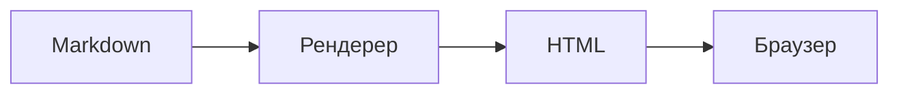
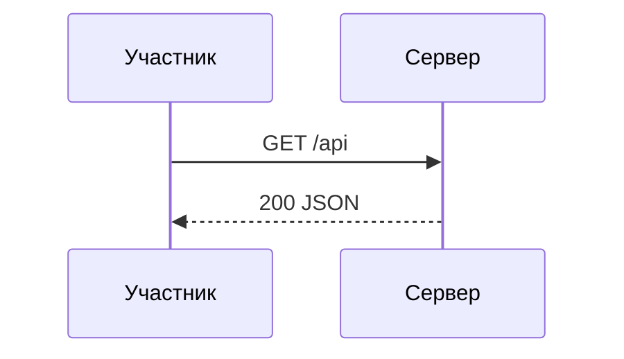
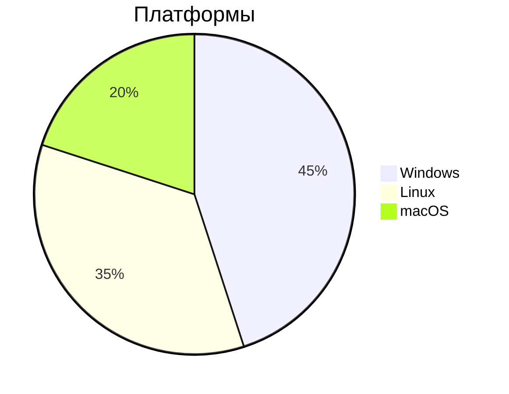

# Стартовый мануал по Markdown для новичков

## Содержание

- [Зачем нужен Markdown](#зачем-нужен-markdown)
- [Где используется Markdown](#где-используется-markdown)
- [Как Markdown становится HTML](#как-markdown-становится-html)
- [Заголовки](#заголовки)
  - [Стиль с подчёркиванием](#стиль-с-подчёркиванием)
- [Списки](#списки)
  - [Маркированные списки](#маркированные-списки)
  - [Нумерованные списки](#нумерованные-списки)
  - [Вложенные списки](#вложенные-списки)
- [Выделение текста](#выделение-текста)
- [Ссылки и картинки](#ссылки-и-картинки)
  - [Ссылки](#ссылки)
  - [Картинки](#картинки)
- [Код](#код)
  - [Код в строке](#код-в-строке)
  - [Блоки кода и подсветка синтаксиса](#блоки-кода-и-подсветка-синтаксиса)
- [Таблицы](#таблицы)
- [Цитаты](#цитаты)
- [Горизонтальные линии](#горизонтальные-линии)
- [Чекбоксы](#чекбоксы)
- [Экранирование спецсимволов](#экранирование-спецсимволов)
- [Переносы строк и абзацы](#переносы-строк-и-абзацы)
- [HTML внутри Markdown](#html-внутри-markdown)
- [Якоря и «Содержание»](#якоря-и-содержание)
- [Расширения Markdown](#расширения-markdown)
- [Диаграммы Mermaid](#диаграммы-mermaid)
- [Спецификации: CommonMark и GFM](#спецификации-commonmark-и-gfm)
- [Редакторы и инструменты](#редакторы-и-инструменты)
- [Онлайн-тренажеры и ресурсы](#онлайн-тренажеры-и-ресурсы)
- [Практика](#практика)
  - [Задание 1. Первая заметка](#задание-1-первая-заметка)
  - [Задание 2. Таблица с якорями](#задание-2-таблица-с-якорями)
  - [Задание 3. Код-блоки](#задание-3-код-блоки)
- [Полезные ссылки](#полезные-ссылки)

---

## Зачем нужен Markdown

Markdown — это **облегчённый язык разметки** для текста: простой синтаксис, который легко писать и читать, и который превращается в готовый HTML.

Ключевая идея: файл должен быть читаемым **и в исходном виде**, и после рендеринга. Одна и та же запись:

```markdown
# Заголовок
**жирный текст** и обычный
```

выглядит почти одинаково и как текст в редакторе, и как страница на экране.

Популярность Markdown объясняется просто:

- **проще, чем HTML** — не нужно захлопывать теги;
- **универсален** — тот же файл показывают GitHub, Obsidian, заметки, блоги;
- **устойчив во времени** — `.md`-файл это обычный текст, он откроется через 20 лет;
- **дружит с Git** — правки в тексте легко сравнивать в диффах.

Markdown **не заменяет HTML**. Он покрывает небольшое подмножество блочных и строчных элементов (заголовки, абзацы, списки, ссылки, код...), а всё остальное можно вставить как сырой HTML — об этом ниже.

## Где используется Markdown

Markdown встречается буквально везде, где нужен структурированный текст кроме «ворда»:

- **GitHub, GitLab, Bitbucket** — файлы `README.md`, описание issues и pull request'ов, Wiki, комментарии в ревью. GFM (GitHub Flavored Markdown) — де-факто стандарт индустрии.
- **Obsidian** — личная база знаний на локальных `.md`-файлах, связи между заметками `[[внутренние ссылки]]`.
- **Joplin** — менеджер заметок, хранилище тоже в Markdown.
- **Telegram** — встроенная *Markdown*-разметка для ботов (Markdown/HTML у Bot API).
- **Форумы и комментарии** — Reddit, Stack Overflow (разметка Markdown), Discourse.
- **Блоги и статические сайты** — Hugo, Jekyll, MkDocs, Docusaurus, Sphinx.
- **Обмен сообщениями** — Slack и Discord (упрощённые варианты разметки).
- **Документация** — любые `README` и `docs/`, книги в GitBook, конспекты.

## Как Markdown становится HTML

Markdown-файл сам по себе ничего не показывает — нужен **рендерер** (процессор). Он разбирает текст по правилам и выдаёт HTML, который уже строит браузер или приложение.

```
заметка.md                         рендерер                         HTML-страница
┌─────────────────┐    ┌────────────────────────────┐     ┌───────────────────┐
│ # Заголовок     │    │  парсер разбивает текст    │     │ <h1>Заголовок     │
│                  │    │  на «блоки»: заголовок,   │     │   </h1>            │
│ **жирный** текст │───▶│  абзац, список, таблица…  │───▶ │ <p><strong>жирный   │
│                  │    │  каждый блок превращается │     │   </strong> текст</p>
│ ```python        │    │  в элемент HTML           │     │ <pre><code>…</code>│
│ print(1)         │    │                          │     │   </pre>            │
│ ```              │    └────────────────────────────┘     └───────────────────┘
└─────────────────┘
```

Дерево типов элементов Markdown (что во что превращается):

```
                MARKDOWN-ДОКУМЕНТ
                        │
        ┌───────────────┼───────────────────┐
        │               │                   │
   БЛОЧНЫЕ элементы    СТРОЧНЫЕ элементы   СЛУЖЕБНЫЕ
        │               │                   │
  ┌─────┴─────┐    ┌────┴───────┐     ┌─────┴──────┐
  │ # ## ###  │    │ *курсив*   │     │  экранирование
  │ параграф  │    │ **жирный** │     │  \*
  │ > цитата  │    │ `код`      │     │  ссылки-сноски
  │ - список  │    │ [ссылка]() │     │  <автоссылка>
  │ 1. список │    │ ![картинка]│     └────────────┘
  │ таблица   │    └────────────┘
  │ код-блок  │
  │ --- линия │
  │ [x] галка │
  └───────────┘

   блоки  →  <h1>, <p>, <blockquote>, <ul>/<ol>,
             <table>, <pre><code>, <hr>, <input type=checkbox>
   строки →  <em>, <strong>, <code>, <a>, 
```

Что стоит запомнить:

- **Блочные** элементы задают структуру страницы (новые блоки/строки).
- **Строчные** (inline) работают внутри абзаца, не разрывая его.
- Разные рендереры (CommonMark, GFM, Obsidian) чуть отличаются в деталях — например, в чекбоксах и таблицах (это не строгий CommonMark, а расширения).

## Заголовки

От 1 до 6 уровней: количество `#` перед текстом = уровень.

```markdown
# Заголовок 1-го уровня   (самый крупный)
## Заголовок 2-го уровня
### Заголовок 3-го уровня
#### Заголовок 4-го уровня
##### Заголовок 5-го уровня
###### Заголовок 6-го уровня
```

Не обязательно, но можно закрывать заголовок решётками (классика старых гайдов):

```markdown
### Заголовок ###
```

**Правила хорошего тона:**

- в документе обычно один `#` (имя документа), дальше начинайте с `##`;
- используйте уровни **последовательно** (не прыгайте с `##` на `#####`);
- заголовки участвуют в якорях и оглавлении (см. раздел «Якоря»).

### Стиль с подчёркиванием

Классический Markdown знает ещё один стиль — подчёркивание снизу:

```markdown
Заголовок первого уровня
========================

Заголовок второго уровня
------------------------
```

Работает только для H1 (=) и H2 (-). Стиль с `#` удобнее и встречается чаще.

## Списки

### Маркированные списки

Три равнозначных маркера: `-`, `*`, `+`. Результат одинаковый, поэтому в одном списке придерживайтесь одного символа (обычно `-`).

```markdown
- Проводник
- Полупроводник
- Диэлектрик
```

```markdown
* Проводник
* Полупроводник
```

```markdown
+ Проводник
+ Полупроводник
```

### Нумерованные списки

```markdown
1. Первый пункт
2. Второй пункт
3. Третий пункт
```

Номера в исходнике рендерер не учитывает — итоговый HTML всегда самому пронумерует с 1. Поэтому почти везде можно писать «все единички» и не перенумеровывать при правках:

```markdown
1. Первый пункт
1. Второй пункт
1. Третий пункт
```

### Вложенные списки

Вложенность = **отступ в 2–4 пробела** (или таб) перед маркером:

```markdown
- Фрукты
  - Яблоки
  - Груши
- Овощи
  1. Морковь
  2. Свёкла

1. Установка
   1. Скачать
   2. Распаковать
2. Настройка
```

Внутри пункта можно вставить цитату (с отступом) или код-блок (с двойным отступом, 8 пробелов):

```markdown
1. Элемент с цитатой:

    > Цитата внутри списка.

2. Элемент с кодом:

        print("это код")
```

## Выделение текста

| Синтаксис | Результат | HTML |
| --- | --- | --- |
| `*курсив*` или `_курсив_` | *курсив* | `<em>` |
| `**жирный**` | **жирный** | `<strong>` |
| `***жирный курсив***` | ***жирный курсив*** | `<em><strong>` |
| `~~зачёркнутый~~` | ~~зачёркнутый~~ | `<del>` (GFM) |

```markdown
*курсив*
**жирный**
***жирный курсив***
~~зачёркнутый текст~~
```

Выделение можно использовать внутри слов, не разрывая их пробелами:

```markdown
Пере___распред___деление
не_пон___ятно_ли?
```

**Важно для русского текста:** символ `_` внутри слова может «прилипать» к `_`. В кириллице надёжнее использовать звёздочки `*` — многие рендереры не делают курсив из `_слово_` с русскими буквами, а звёздочки работают всегда:

```markdown
_русский текст_    # может НЕ сработать в некоторых рендерерах
*русский текст*    # работает везде
```

## Ссылки и картинки

### Ссылки

Классическая форма — «текст в квадратных скобках, адрес в круглых»:

```markdown
[Текст ссылки](https://example.com)

[Текст с подсказкой](https://example.com "Всплывающая подсказка")
```

Ссылки-сноски (справочник в конце документа) — удобны, когда URL длинный и повторяется:

```markdown
[Текст ссылки][link-id]

[link-id]: https://example.com "Опциональная подсказка"
```

Сокращённая форма — метка совпадает с текстом ссылки, так что её можно опустить:

```markdown
[GitHub][]

[GitHub]: https://github.com
```

Автоссылки (адрес прямо в угловых скобках, без текста):

```markdown
<https://example.com>

<mail@example.com>   # email сделается mailto: ссылкой
```

### Картинки

Синтаксис как у ссылки, но с `!` спереди. Текст в `[]` — это alt-текст (показывается, если картинка не загрузилась, и читают скринридеры):

```markdown


```

Картинка-ссылка — оборачиваем картинку в ссылку:

```markdown
[](https://example.com)
```

Замечание: у чистого Markdown **нет способа задать размер** картинки (ширину/высоту). На GitHub и в Obsidian помогут HTML-атрибуты — см. «HTML внутри Markdown».

## Код

### Код в строке

Обрамляем слово/фрагмент одиночными обратными кавычками `` ` ``:

```markdown
Используйте команду `pip install requests`
```

Отображение: моноширинный шрифт, никакая разметка внутри не работает.

Если внутри кода есть сам бэктик — используем двойной:

```markdown
Текст с `` `code` `` внутри
```

### Блоки кода и подсветка синтаксиса

Классический способ — отступ в 4 пробела или таб у каждой строки:

```markdown
    Это блок кода
```

Современный и везде работающий — **fenced code blocks** (обрамление тройными бэктиками). После первой ` ``` ` указывается язык — появится подсветка синтаксиса:

````markdown
```python
def hello():
    print("Привет!")
```
````

````markdown
```bash
pip install requests
```
````

Подсветка поддерживает десятки языков: `python`, `bash`, `json`, `html`, `css`, `sql`, `yaml`, `toml`, `markdown` и т.д. Если указать `text` — подсветки не будет (иногда это осознанно). Блоки кода можно вкладывать в списки (отступ 8 пробелов) и не бояться, что разметка внутри сломается.

## Таблицы

Таблицы даёт только GFM (GitHub Flavored Markdown) — в строгом CommonMark их нет. Оформление:

```markdown
| Колонка 1 | Колонка 2 | Колонка 3 |
| --------- | :-------: | --------: |
| текст     | по центру | справа    |
| ещё       | строка   | 42        |
```

Первая строка — заголовки, вторая — разделитель с выравниванием:

- `---` — слева;
- `:---:` — по центру;
- `---:` — справа.

Выравнивание «шапки» можно не соблюдать в строках с данными. Записи через `|` не обязаны быть идеально выровнены в исходнике — рендерер всё выровняет сам:

```markdown
| Имя | Роль |
|---|--|
| Нео | Избранный |
| Тринити | Пилот |
```

Для длинных таблиц полезно: перенос строки в ячейку — тег `<br>` (см. HTML в Markdown).

## Цитаты

Блочная цитата — символ `>` в начале строки:

```markdown
> Это цитата.
> Можно ставить `>` перед каждой строкой,
> а можно только перед первой.

> Второй абзац цитаты — отделяется пустой строкой.
```

Цитаты вкладываются друг в друга добавлением `>`:

```markdown
> Первый уровень
>> Второй уровень
>>> Третий уровень (и так далее)
```

Внутри цитат работает обычная разметка — заголовки, списки, код:

```markdown
> ## Заголовок внутри цитаты
> - пункт
> - ещё пункт
```

## Горизонтальные линии

Три и более `-`, `*` или `_` на отдельной строке:

```markdown
---

***

___
```

Правило: при дефисах `---` оставляйте пустую строку **сверху**, иначе `---` превратится в заголовок второго уровня:

```markdown
Текст без пустой строки
---
получится подчёркнутым заголовком
```

```markdown
Текст

---
```

## Чекбоксы

Задача-список (task list) — элемент GFM. Используется в README, issue и заметках:

```markdown
- [x] Сделано
- [ ] В работе
- [ ] Не начато
```

Внимание: маркер — `[x]` или `[ ]` (с пробелом внутри). Внутри чекбокса работает любая разметка — `- [ ] **жирное** задание`.

## Экранирование спецсимволов

Обратный слеш `\` перед служебным символом заставляет показывать его буквально:

```markdown
\*звёздочка\* не сделает курсив

\# не станет заголовком

\[не\](станет ссылкой)
```

Список символов, которые можно экранировать: `` \ ` * _ { } [ ] ( ) # + - . ! ``

Нужен для примеров разметки внутри документа — как в этом мануале. Ещё пример: показать литералы `|` и `*` в таблице:

```markdown
| Условие | Результат |
|---------|-----------|
| `a \| b` | альтернатива |
```

## Переносы строк и абзацы

Правило преподобного Грубера (и CommonMark):

- **один перевод строки** в исходнике — это **пробел** в результате (абзац продолжается);
- **пустая строка** между строчками — новый **абзац** (`<p>`);
- **два пробела в конце строки** — жёсткий перенос (`<br>`).

```markdown
Это первая
строка (в HTML будут склеены)

Это новый абзац.

Эта строка заканчивается двумя пробелами.  
Эта строка начнётся с новой строки.
```

В Obsidian, Joplin, Typora и на GitHub часто есть «режим строгого переноса» (strict line breaks), где каждый перевод строки даёт `<br>`. Для максимальной совместимости придерживайтесь правил CommonMark: одна строка = пространство смысла, пустая строка = новый блок.

## HTML внутри Markdown

Рендереры разрешают вставлять **сырой HTML** — он проходит насквозь без обработки. Это легальный способ расширить возможности:

```html
Можно просто <em>так</em> или даже <span style="color:red">цветной текст</span>.
```

Полезные примеры:

```html
<!-- размер картинки (недоступен в чистом Markdown): -->


<!-- перенос строки внутри ячейки таблицы: -->
| A | B |
|---|:--|
| текст <br> вторая строка | 1 |

<!-- раскрывающийся блок (работает на GitHub): -->
<summary>Развернуть</summary>
Скрытый текст.
```

Правила: HTML-блоки (`<div>`, `<table>`...) должны отделяться пустыми строками; внутри HTML разметка Markdown не обрабатывается.

## Якоря и «Содержание»

Якорь — это невидимая «ручка», к которой можно перейти по ссылке. Ссылка вида `[текст](#якорь)` прыгает на элемент с этим id.

Как рендерер строит якорь из заголовка (правило GitHub):

```
# Что
# Установка и запуск
# Python: f-строки и "%"
       ↓
что
установка-и-запуск
python-f-строки-и-
```

Алгоритм превращения заголовка в якорь:

1. весь текст приводится к **нижнему регистру**;
2. **пробелы** → `-`;
3. **спецсимволы** (точки, запятые, скобки, `:`, `%`, `#`, `_`) убираются (**`_`** обычно тоже, но на GitHub `_` остаётся);
4. повторные `---` схлопываются.

Поэтому это «Содержание» можно собрать руками:

```markdown
## Содержание
- [Заголовки](#заголовки)
- [Таблицы](#таблицы)
```

...где `#заголовки` — это якорь от заголовка `## Заголовки`.

Ссылки на якорь работают и из «тела» документа, и как URL с фрагментом: `https://github.com/user/repo#readme`.

Нюанс для кириллицы: в ссылке якорь оставляют как текст (`#установка-и-запуск`) — это работает на GitHub, GitHub-совместимых рендерерах и в Obsidian. Некоторые рендереры требуют URL-кодирования (`#%D1%83...`) — тогда ссылку сгенерирует сам редактор.

## Расширения Markdown

Базовый CommonMark скучен для реальной жизни, поэтому существует стандартный набор расширений GFM и «клубных» фич:

| Расширение | Синтаксис | Где встречается |
| --- | --- | --- |
| Таблицы | `\| a \| b \|` | GitHub, Obsidian, Typora |
| Чекбоксы | `- [ ]`, `- [x]` | GitHub, Obsidian, Typora |
| Сноски | `текст[^1]` + `[^1]: определение` | Obsidian, Typora, Pandoc |
| Оглавление | `[TOC]` или `## Содержание` | Obsidian, Typora, некоторые рендереры |
| Зачёркивание | `~~текст~~` | GFM |
| Автоссылки | `<https://...>` | CommonMark |
| Mermaid-диаграммы | ```` ```mermaid ```` | GitHub, Obsidian, Typora (плагин) |
| LaTeX-математика | `$x^2$`, `$$...$$` | GitHub, Obsidian, Typora |
| Внутренние ссылки | `[[Заметка]]`, `[[Заметка#Заголовок]]` | Obsidian |
| Врезки/адаптивность | `> [!note]` | Obsidian, GitHub |

### Сноски

```markdown
Текст с примечанием[^1].

[^1]: Само примечание — его можно разместить в конце документа.
```

### Оглавление

В Obsidian и Typora часто работает волшебное `[TOC]` (автоматически соберёт оглавление из заголовков):

```markdown
[TOC]
```

## Диаграммы Mermaid

Mermaid — язык описания диаграмм в тексте. Поддерживается на GitHub (в `.md`), в Obsidian (плагин/штатно), в Typora.

```markdown

```

Рисуется блок-схема. Другие типы диаграмм:

```markdown

```

```markdown

```

Mermaid — отдельная большая тема, здесь достаточно «знать, что такое есть». Полный список типов (flowchart, sequenceDiagram, classDiagram, stateDiagram, pie, gantt...) — в официальной документации.

## Спецификации: CommonMark и GFM

- **CommonMark** — официальная строгая спецификация Markdown и эталонные тесты. Один и тот же документ должен рендериться одинаково в любом CommonMark-процессоре. Стабильный «минимум»: заголовки, абзацы, блоки кода с отступом, цитаты, списки, линии, код и выделение в строке, ссылки/картинки, экранирование, автоссылки.
- **GFM (GitHub Flavored Markdown)** — надстройка GitHub поверх CommonMark: таблицы, чекбоксы, зачёркивание, автоссылки, fenced code blocks с подсветкой, Mermaid, математика.

Практический совет: пишите по CommonMark (максимальная совместимость), а дополнительный сахар (таблицы, чекбоксы, Mermaid) используйте там, где он точно поддержан — на GitHub и в вашем редакторе.

## Редакторы и инструменты

| Инструмент | Тип | Сильные стороны |
| --- | --- | --- |
| **Obsidian** | заметочник на `.md` | сети заметок `[[...]]`, плагины, граф, хорош для базы знаний. Подробности — в этой же папке. |
| **Joplin** | заметочник | локальные Markdown-заметки + синхронизация |
| **Typora** | dedicated-редактор markdown | WYSIWYG: разметка «проявляется» прямо в тексте |
| **VS Code** | редактор кода | встроенный превью: `Ctrl+Shift+V`; плагины (Markdown All in One и др.) |
| **GitHub** | веб | стандарт де-факто, автооглавление, рендер `.md` |
| **Pandoc** | конвертер | `.md → .html/.pdf/.docx` для кого продвинутее |

Быстрая проверка результата (голый Python):

```bash
python -c "import markdown; print(markdown.markdown(open('заметка.md').read()))"
```

(нужно `pip install markdown`). Или откройте файл в VS Code и нажмите `Ctrl+Shift+V`.

## Онлайн-тренажеры и ресурсы

Площадки для изучения и отработки Markdown:

| Ресурс | Описание |
| --- | --- |
| Markdown Tutorial — https://commonmark.org/help/tutorial/ | Интерактивный туториал по CommonMark — стандарту Markdown. |
| Dillinger — https://dillinger.io/ | Онлайн-редактор Markdown с предпросмотром и экспортом. |
| StackEdit — https://stackedit.io/ | Браузерный Markdown-редактор с синхронизацией и поддержкой LaTeX. |
| Markdown Table Generator — https://www.tablesgenerator.com/markdown_tables | Генератор таблиц Markdown — удобно создавать и редактировать. |
| Marp — https://marp.app/ | Презентации на Markdown — превращайте .md в слайды. |
| GitHub Flavored Markdown — https://docs.github.com/en/get-started/writing-on-github | Спецификация GFM от GitHub — стандарт для README. |

## Практика

### Задание 1. Первая заметка

Создайте файл `первая.md` и напишите заметку «Мой первый Markdown», включив в неё: заголовок H1, два раздела с заголовками H2, маркированный список планов на неделю, один нумерованный список шагов, одну цитату и одну горизонтальную линию.

Ожидаемый минимальный результат (проверьте в превью):

```markdown
# Мой первый Markdown

## Планы
- выучить синтаксис
- написать заметку
- настроить Obsidian

## Шаги на сегодня
1. Открыть редактор
2. Написать код
3. Посмотреть превью

> Простота — это высшая форма изощрённости.

---
```

### Задание 2. Таблица с якорями

1. Создайте таблицу «Сравнение редакторов» с колонками: Название, Цена, Платформы. Выровняйте вторую колонку по центру.
2. Добавьте в документ заголовок `## Настройки` и сделайте ссылку на него из начала документа.
3. В ячейку таблицы добавьте вторую строку через `<br>`.

Ожидаемый результат:

```markdown
[Перейти к настройкам](#настройки)

| Название | Цена | Платформы |
| :---: | :---: | :--- |
| Obsidian | бесплатно | Win / macOS / Linux |
| Typora | платная | Windows / macOS / Linux |
| VS Code | бесплатно | Win / macOS <br> / Linux |

## Настройки
Тёмная тема, автоматическое оглавление, хоткей `Ctrl+N` для новой заметки.
```

### Задание 3. Код-блоки

1. Создайте документ `пример.md`.
2. Вставьте inline-код: «Установка библиотеки: `pip install requests`».
3. Добавьте fenced-блок с языком `python` и кодом:

```python
import requests

r = requests.get("https://httpbin.org/get")
print(r.status_code)
```

4. Добавьте fenced-блок с языком `bash`:

```bash
python example.py
```

5. Проверьте, что в превью код подсвечен и внутри блоков не «срабатывает» разметка.

### Бонус: соберите «Содержание»

Возьмите документ с тремя заголовками `##` из задания 1–3 и соберите вверху список ссылок-якорей вручную (как в этом мануале). Убедитесь, что клики по пунктам оглавления переносят к нужным разделам.

## Полезные ссылки

- [CommonMark spec](https://spec.commonmark.org/) — эталонная спецификация.
- [GitHub Flavored Markdown](https://github.github.com/gfm/) — расширения GitHub.
- [Mermaid](https://mermaid.js.org/) — документация диаграмм.
- Ваша заметка [Markdown](/home/als/notes/Markdown.md) — классический разбор синтаксиса.
- Смежная тема — [Регулярные выражения](/home/als/Regexp.md), отдельный мануал-справочник.