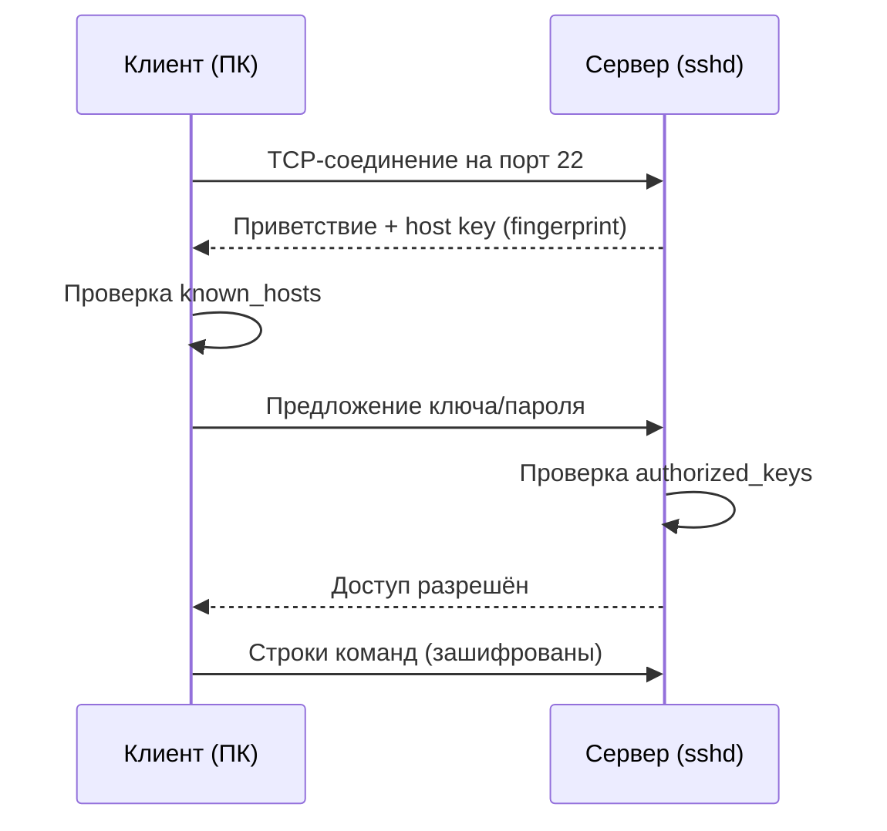
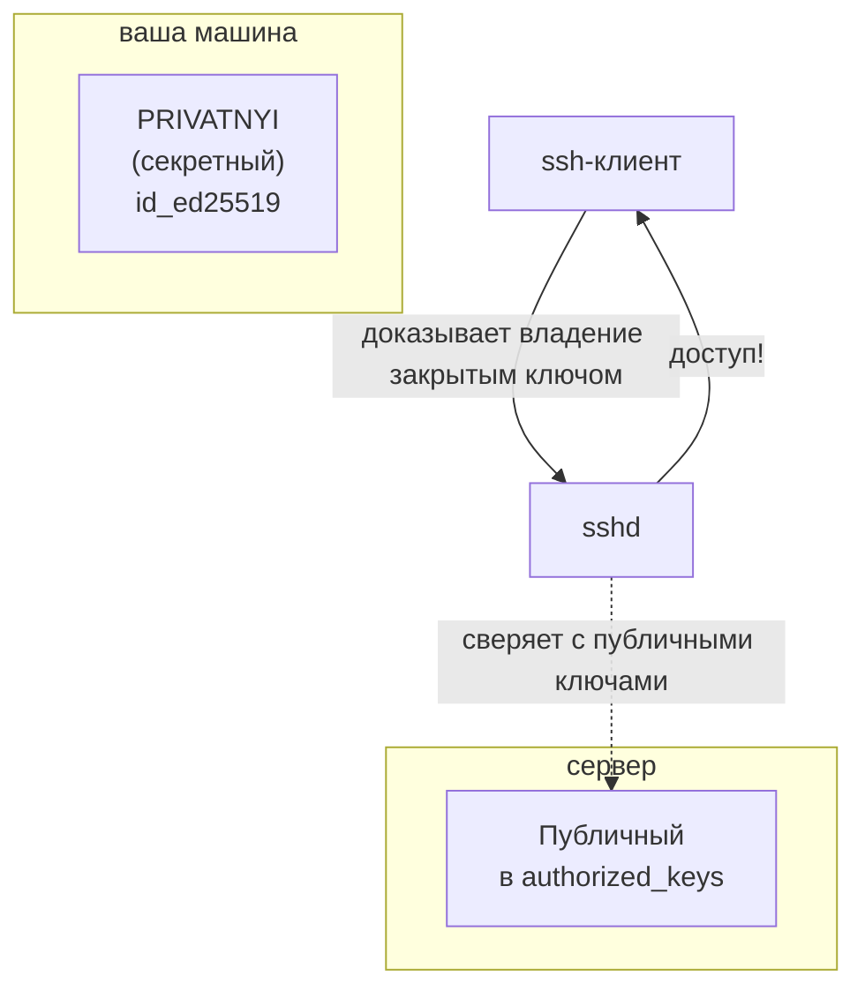
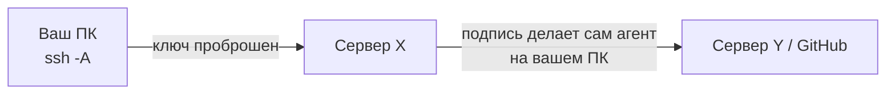
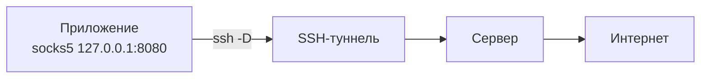
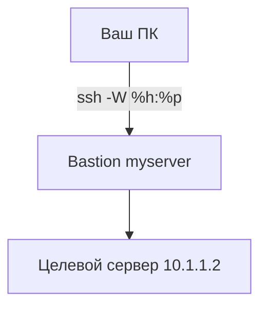

# SSH — сводный гайд и шпаргалка

**SSH** (Secure Shell) — криптографический протокол для безопасного удалённого управления серверами и передачи файлов. SSH шифрует весь трафик между вашим компьютером и удалённым сервером, поэтому пароли и данные не перехватываются. Заменил небезопасный Telnet и стал стандартом для администрирования Linux-серверов.

### С чего начать новичку

1. **Что такое SSH** — 3 минуты теории (раздел ниже);
2. **Как это работает** — клиент–сервер, что происходит при подключении;
3. **Первое подключение** — команда `ssh`, fingerprint, пароль;
4. **SSH-клиенты** — чем пользоваться на практике;
5. **Ключи** — генерация, загрузка на сервер, `ssh-agent` → вход без пароля;
6. **Алиасы `~/.ssh/config`** — короткие команды вместо длинных адресов;
7. Дальше — по вкусу: копирование файлов, туннели, GitHub, сервер.

## Содержание


- [С чего начать новичку](#с-чего-начать-новичку)
- [Содержание](#содержание)
- [Что такое SSH](#что-такое-ssh)
  - [Для чего нужен SSH](#для-чего-нужен-ssh)
  - [Чем SSH отличается от Telnet](#чем-ssh-отличается-от-telnet)
- [Как устроен SSH: клиент–сервер](#как-устроен-ssh-клиентсервер)
  - [Что происходит при подключении](#что-происходит-при-подключении)
- [Первое подключение](#первое-подключение)
  - [Что спросит первый раз (fingerprint)](#что-спросит-первый-раз-fingerprint)
- [SSH-клиенты для Linux (только open source)](#ssh-клиенты-для-linux-только-open-source)
  - [1. OpenSSH (ssh) — стандарт по умолчанию](#1-openssh-ssh--стандарт-по-умолчанию)
  - [2. Terminus — современный терминал со вкладками](#2-terminus--современный-терминал-со-вкладками)
  - [3. PuTTY — классика (для перекрёстной работы и старых систем)](#3-putty--классика-для-перекрёстной-работы-и-старых-систем)
  - [4. Terminator — терминал с разделённым окном](#4-terminator--терминал-с-разделённым-окном)
  - [5. Asbru Connection Manager — менеджер SSH-соединений с GUI](#5-asbru-connection-manager--менеджер-ssh-соединений-с-gui)
  - [6. Remmina — универсальный удалённый доступ «всё в одном»](#6-remmina--универсальный-удалённый-доступ-всё-в-одном)
  - [7. Termux (Android) — SSH с телефона](#7-termux-android--ssh-с-телефона)
- [Компаньоны SSH: mosh, autossh, tmux](#компаньоны-ssh-mosh-autossh-tmux)
  - [mosh (Mobile Shell) — SSH, переживающий обрывы сети](#mosh-mobile-shell--ssh-переживающий-обрывы-сети)
  - [autossh — авто-восстановление туннелей](#autossh--авто-восстановление-туннелей)
  - [tmux — «спаси, если ssh оборвался»](#tmux--спаси-если-ssh-оборвался)
- [Мультиплексирование соединений (ControlMaster)](#мультиплексирование-соединений-controlmaster)
- [SSH-ключи: генерация](#ssh-ключи-генерация)
  - [Генерация ключа](#генерация-ключа)
  - [Что получится в ~/.ssh](#что-получится-в-ssh)
  - [Права на ключи (важно!)](#права-на-ключи-важно)
- [Загрузка ключа на сервер](#загрузка-ключа-на-сервер)
  - [Способ 1 (рекомендованный): ssh-copy-id](#способ-1-рекомендованный-ssh-copy-id)
  - [Способ 2 — вручную](#способ-2--вручную)
  - [Права НА СЕРВЕРЕ — критичны](#права-на-сервере--критичны)
- [ssh-agent: хранитель ключей](#ssh-agent-хранитель-ключей)
  - [Запуск и добавление ключа](#запуск-и-добавление-ключа)
  - [Проброс агента (-A / ForwardAgent)](#проброс-агента--a--forwardagent)
- [Алиасы в ~/.ssh/config](#алиасы-в-sshconfig)
  - [Базовая запись для одного хоста](#базовая-запись-для-одного-хоста)
  - [Пример ~/.ssh/config](#пример-sshconfig)
  - [Несколько алиасов и общие настройки](#несколько-алиасов-и-общие-настройки)
  - [Проверка и отладка конфига](#проверка-и-отладка-конфига)
- [Удалённое исполнение команд](#удалённое-исполнение-команд)
- [Копирование файлов: scp / sftp / rsync / sshfs](#копирование-файлов-scp--sftp--rsync--sshfs)
  - [scp — простое копирование через SSH](#scp--простое-копирование-через-ssh)
  - [rsync — синхронизация (быстрее для больших и повторных копий)](#rsync--синхронизация-быстрее-для-больших-и-повторных-копий)
  - [sftp — интерактивный файловый доступ](#sftp--интерактивный-файловый-доступ)
  - [sshfs — смонтировать удалённую папку как локальную](#sshfs--смонтировать-удалённую-папку-как-локальную)
- [Туннели и проброс портов](#туннели-и-проброс-портов)
  - [Локальный проброс: -L (LocalForward)](#локальный-проброс--l-localforward)
  - [Обратный проброс: -R (RemoteForward)](#обратный-проброс--r-remoteforward)
  - [SOCKS-прокси: -D (DynamicForward)](#socks-прокси--d-dynamicforward)
  - [X11-проброс — графические приложения с сервера](#x11-проброс--графические-приложения-с-сервера)
  - [Схема всех трёх видов проброса](#схема-всех-трёх-видов-проброса)
- [Прыжки через промежуточный сервер (Jump Host)](#прыжки-через-промежуточный-сервер-jump-host)
- [SSH и GitHub](#ssh-и-github)
  - [Настройка SSH-ключа для GitHub](#настройка-ssh-ключа-для-github)
  - [Если репозиторий уже по HTTPS — перевести на SSH](#если-репозиторий-уже-по-https--перевести-на-ssh)
  - [gh CLI — SSH по умолчанию](#gh-cli--ssh-по-умолчанию)
- [Настройка SSH-сервера (sshd)](#настройка-ssh-сервера-sshd)
  - [Минимальная безопасность](#минимальная-безопасность)
  - [Хостовые ключи сервера](#хостовые-ключи-сервера)
- [Проверка, диагностика и расшифровка ошибок](#проверка-диагностика-и-расшифровка-ошибок)
  - [Что могут значить сообщения](#что-могут-значить-сообщения)
- [Решение типовых проблем](#решение-типовых-проблем)
  - [«Unable to negotiate with ... no matching host key type found»](#unable-to-negotiate-with--no-matching-host-key-type-found)
  - [FileZilla/SFTP не пускает на сервер](#filezillasftp-не-пускает-на-сервер)
  - [Windows: ключ «права слишком открыты» (OpenSSH блокирует)](#windows-ключ-права-слишком-открыты-openssh-блокирует)
  - [Windows 7: нет встроенного ssh](#windows-7-нет-встроенного-ssh)
  - [Про authorized_keys2](#про-authorized_keys2)
- [Сводка флагов и опций](#сводка-флагов-и-опций)
- [Онлайн-тренажеры и ресурсы](#онлайн-тренажеры-и-ресурсы)
- [Полезные ссылки](#полезные-ссылки)

---

## Что такое SSH

**SSH** (Secure SHell — «защищённая оболочка») — это протокол защищённого удалённого доступа к компьютерам. Через SSH вы выполняете команды в терминале машины, которая физически находится в другом месте.

> Иными словами, SSH — это **дистанционная командная строка**. Визуально вы работаете на своём компьютере, но в реальности — на другом.

- **Протокол** — это набор соглашений (правил), по которым программы обмениваются информацией. SSH — набор правил, известный и вашему компьютеру, и отдалённому.
- **«Защищённый»** — все данные передаются в **зашифрованном виде**, как в HTTPS и онлайн-банкинге. Даже перехватив трафик, злоумышленник не сможет его прочитать.

### Для чего нужен SSH

- Управлять сервером хостинг-провайдера, который может быть на другом конце света;
- Заходить на VPS по **ключу** вместо пароля;
- Передавать файлы (`scp`, `rsync`, `sftp`) без лишних сервисов;
- Прокидывать порты и строить туннели (безопасный доступ к панелям, БД);
- Безопасно подключаться к GitHub/GitLab для `git push` / `pull`.

### Чем SSH отличается от Telnet

Telnet — старая утилита, передающая всё (включая пароли) **в открытом виде**. SSH — современный защищённый протокол с шифрованием. В Linux и macOS клиент `ssh` уже встроен в систему.

---

## Как устроен SSH: клиент–сервер

У SSH две стороны: **клиент** (ваш ПК) и **сервер** (`sshd` — служба, которая слушает порт `22` на удалённой машине и ждёт подключений).

```text
┌───────────────┐        ┌──────────────────────────────┐
│  ВАШ ПК       │        │  УДАЛЁННЫЙ СЕРВЕР            │
│  (клиент)     │  SSH   │  (sshd, порт 22)             │
│               │ ═════▶ │                              │
│ ssh user@host │        │  проверит ключ → даст шелл/  │
│               │◀═════  │  выполнит команды            │
└───────────────┘        └──────────────────────────────┘
```


### Что происходит при подключении

1. Клиент подключается к серверу по TCP-порту `22`;
2. Стороны договариваются об алгоритмах шифрования и обмениваются ключами;
3. Проверяется **fingerprint** сервера (первые подключения — по подтверждению пользователя);
4. Происходит **аутентификация**: по паролю или по ключу;
5. Устанавливается шифрованная сессия — вы получаете командную строку.



---

## Первое подключение

```bash
ssh username@remote_host -p port
```

- Если порт не указан — используется стандартный **22**;
- Если имя пользователя совпадает с локальным — можно опустить: `ssh server_ip`.

Пример:

```bash
ssh user@server_ip
```

После этого система запросит пароль удалённого пользователя:

```text
user@server_ip's password:
```

### Что спросит первый раз (fingerprint)

При первом подключении клиент не знает сервер:

```text
The authenticity of host 'server_ip (server_ip)' can't be established.
ECDSA key fingerprint is fd:fd:d4:f9:77:fe:73:84:e1:55:00:ad:d6:6d:22:fe.
Are you sure you want to continue connecting (yes/no)? yes
```

Введите `yes` один раз. Файл `~/.ssh/known_hosts` запомнит «отпечаток» сервера.

**Зачем это нужно:** если сервер переустановили или перед вами «подстава» — fingerprint изменится, и вы это увидите. Если отпечаток не меняется, сообщение больше не появится.

---

## SSH-клиенты для Linux (только open source)

Базовая работа — через встроенный **OpenSSH**. Для удобства и графических сценариев есть хорошие опенсорс-клиенты. Всё ниже — **открытый код, бесплатно, с открытой лицензией**.

### 1. OpenSSH (`ssh`) — стандарт по умолчанию

Встроенный клиент на всех Linux/macOS. BSD-лицензия. Не имеет GUI, но даёт 100% возможностей протокола (ключи, туннели, aliases, scp/sftp).

```bash
sudo apt install openssh-client    # Debian/Ubuntu/ALT
sudo pacman -S openssh             # Arch/Manjaro/EndeavourOS
```

### 2. Terminus — современный терминал со вкладками

Красивый терминал-эмулятор со встроенными SSH-профилями, вкладками и разделёнными панелями. **MIT-лицензия.** Удобен, если хочется держать несколько серверов в вкладках.

```bash
flatpak install flathub com.zyedidia.terminus   # или со страницы GitHub releases
```

### 3. PuTTY — классика (для перекрёстной работы и старых систем)

Традиционный клиент с GUI, сохранёнными сессиями и форматом `.ppk`. **MIT-лицензия.** Пригодится, когда общаетесь с Windows-коллегами и устаревшим железом.

```bash
sudo apt install putty    # Debian/Ubuntu
sudo pacman -S putty      # Arch
```

### 4. Terminator — терминал с разделённым окном

Позволяет **разделить окно на несколько SSH-сессий** (по горизонтали/вертикали) — удобно следить сразу за несколькими серверами. **GPL-2.0.**

```bash
sudo apt install terminator
sudo pacman -S terminator
```

### 5. Asbru Connection Manager — менеджер SSH-соединений с GUI

Бывший Pac Manager. Список серверов, группы, быстрые подключения, встроенный SFTP. **GPL-2.0.**

```bash
sudo add-apt-repository ppa:asbru-cm/releases && sudo apt install asbru-cm
```

### 6. Remmina — универсальный удалённый доступ «всё в одном»

Графический клиент: SSH, SFTP, RDP, VNC. **GPL-2.0.** Удобно, если помимо SSH нужны RDP/VNC.

```bash
sudo apt install remmina
```

### 7. Termux (Android) — SSH с телефона

CLI-терминал для Android со встроенным OpenSSH. **GPL-3.0.** Установка — из F-Droid или прошивкой пакета напрямую.

> **Как выбрать:** рутина — OpenSSH + алиасы; GUI с профилями — Terminus или Asbru; параллельная работа с несколькими машинами — Terminator; RS-comm/RDP/VNC — Remmina.

---

## Компаньоны SSH: mosh, autossh, tmux

Не клиенты, но незаменимые помощники вокруг SSH. Все — open source.

### mosh (Mobile Shell) — SSH, переживающий обрывы сети

**MIT-лицензия.** Сессия не рвётся при смене Wi-Fi/IP и пережидает обрывы сети; работает поверх UDP-порта 60000+ (нужна установка на обеих сторонах).

```bash
sudo apt install mosh            # и на сервере, и на клиенте
sudo pacman -S mosh              # Arch
mosh user@server                 # вместо ssh — без «прокрутки» при разрывах
```

### autossh — авто-восстановление туннелей

**MIT-лицензия.** Если соединение/туннель оборвался — autossh перезапустит его автоматически. Идеально для постоянных пробросов портов.

```bash
sudo apt install autossh
sudo pacman -S autossh

# пример: постоянно держать туннель к Grafana на сервере
autossh -M 0 -N -L 3000:localhost:3000 myserver
```

### tmux — «спаси, если ssh оборвался»

Терминальный мультиплексор (**ISC-лицензия**). Запускаете на сервере сессию `tmux`, работаете, а если ssh разорвался — подключаетесь заново и «прилипаете» к той же сессии. Все процессы продолжают идти.

```bash
sudo apt install tmux
sudo pacman -S tmux

tmux new -s work                 # создать сессию на сервере
# ... работаете ...
# Ctrl+b, затем d                 # «отцепиться» (сессия живёт дальше)
tmux attach -t work              # вернуться после обрыва/повторного входа
```

> Хоткеи tmux — в заметке «Хоткеи tmux». База: `Ctrl+b` — префикс; `c` — новое окно; `%`/`"` — разделить панель; `d` — отцепиться.

---

## Мультиплексирование соединений (ControlMaster)

Вторая и последующие SSH-сессии к тому же серверу могут **переиспользовать первое TCP-соединение** — вход становится мгновенным (никаких повторных рукопожатий). Открытая и давно встроенная фича OpenSSH.

```ini
# в ~/.ssh/config:
Host *
    ControlMaster auto
    ControlPath ~/.ssh/controlmasters/%r@%h:%p
    ControlPersist 10m
```

- `ControlMaster auto` — создавать master-соединение при первой сессии;
- `ControlPath` — где хранить «сокет» соединения (папку создать: `mkdir -p ~/.ssh/controlmasters`);
- `ControlPersist 10m` — сколько держать master после закрытия последней сессии.

После этого `scp`, `rsync` и новый `ssh` к тому же серверу идут мгновенно — это заметно при работе с пачками файлов.

---

## SSH-ключи: генерация

Ключи позволяют заходить на сервер **без пароля**. Создаётся пара:

- **Приватный (закрытый) ключ** — храните при себе и **никому не показывайте**;
- **Публичный (открытый) ключ** — можно распространять свободно.

> Ключи связаны: зашифрованное публичным ключом может расшифровать только владелец приватного. Это основа и шифрования, и цифровой подписи.



### Генерация ключа

```bash
# Современный и рекомендуемый тип — ed25519 (компактный, быстрый, безопасный)
ssh-keygen -t ed25519 -C "you@example.com"

# Классика — RSA 4096 (для старых серверов, где нет ed25519)
ssh-keygen -t rsa -b 4096 -C "you@example.com"
```

Что спросит:

```text
Generating public/private ed25519 key pair.
Enter file in which to save the key (/home/demo/.ssh/id_ed25519):   ← Enter = прямо в .ssh
Enter passphrase (empty for no passphrase):                          ← Enter = без пароля (удобнее)
```

- **Passphrase** — пароль на ключ. Можно пропустить (Enter) или задать — тогда его нужно будет вводить при использовании (пока ключ не добавлен в ssh-agent).
- **Сменить пароль** существующего ключа: `ssh-keygen -p`.
- Параметры `-t`/`-b`/`-C` — разовая настройка; обычно достаточно просто `ssh-keygen`.

### Что получится в ~/.ssh

```text
~/.ssh/
├── id_ed25519          ← ПРИВАТНЫЙ ключ (никому не показывать!)
├── id_ed25519.pub      ← публичный ключ (копируем на серверы)
├── config              ← алиасы и настройки подключений
├── known_hosts         ← «отпечатки» известных серверов
└── authorized_keys     ← (обычно на сервере, не локально)
```

> Публичный ключ выглядит так: `ssh-ed25519 AAAA...user@myhost` (или `ssh-rsa AAAA...`). Последнее поле (комментарий) не влияет на авторизацию — его можно менять для удобства.

### Права на ключи (важно!)

OpenSSH **отказывается** подключаться, если права слишком широкие:

```bash
chmod 700 ~/.ssh                  # директория
chmod 600 ~/.ssh/id_ed25519       # приватный ключ — только владелец
chmod 644 ~/.ssh/id_ed25519.pub
```

---

## Загрузка ключа на сервер

Чтобы заходить без пароля, публичный ключ нужно один раз положить в `~/.ssh/authorized_keys` **на сервере**.

### Способ 1 (рекомендованный): ssh-copy-id

```bash
ssh-copy-id -i ~/.ssh/id_ed25519.pub user@server_ip     # запросит пароль один раз

# нестандартный порт (обратите внимание на кавычки):
ssh-copy-id "-p 2222 -i ~/.ssh/id_myserver.pub user@server_ip"
```

После этого вход без пароля: `ssh user@server_ip`.

### Способ 2 — вручную

```bash
cat ~/.ssh/id_ed25519.pub | ssh user@server_ip \
  "mkdir -p ~/.ssh && chmod 700 ~/.ssh && \
   cat >> ~/.ssh/authorized_keys && \
   chmod 600 ~/.ssh/authorized_keys"
```

### Права НА СЕРВЕРЕ — критичны

`~/.ssh` → `700`, `authorized_keys` → `600`, домашняя папка не должна быть доступна другим. Иначе `sshd` проигнорирует ключи.

```bash
chmod 700 ~/.ssh
chmod 600 ~/.ssh/authorized_keys
```

> Если скопировали в `authorized_keys` случайно приватный ключ — это не работает; придётся перегенерировать пару. Не путайте `id_rsa` (приватный) и `id_rsa.pub` (публичный).

---

## ssh-agent: хранитель ключей

Две задачи агента:

1. Если у ключа есть passphrase — спрашивать его не придётся при каждом подключении;
2. Если ключей несколько — не нужно указывать нужный вручную: агент сам предложит подходящий серверу.

### Запуск и добавление ключа

```bash
eval "$(ssh-agent -s)"          # запустить агент
ssh-add ~/.ssh/id_ed25519       # добавить ключ (спросит passphrase, если есть)
ssh-add ~/.ssh/id_myserver         # можно добавить несколько
```

Без аргументов `ssh-add` добавит стандартные ключи: `id_rsa`, `id_ed25519`, `id_ecdsa`, `id_dsa`, `identity`.

```bash
ssh-add -L      # список добавленных ключей (их публичные части)
ssh-add -l      # то же, кратко (отпечатки)
```

> Агент привязан к сессии: после перезагрузки ПК ключи нужно добавлять заново (или добавить автозапуск в `~/.bashrc`: `eval "$(ssh-agent -s)" && ssh-add`).

### Проброс агента (`-A` / ForwardAgent)

Нужно с сервера **X** подключиться к серверу **Y** (например, сделать `git pull`), не кладя копию ключей на X:

```bash
ssh -A user@server_ip
```

Ключи из агента станут «виртуально доступны» на сервере, при этом файлы-ключи физически туда не попадут.



---

## Алиасы в ~/.ssh/config

Файл `~/.ssh/config` задаёт **алиасы хостов**: вместо `ssh user@server_ip -p 2222 -i ~/.ssh/id_myserver` достаточно короткого `ssh myserver`. Пользователи, порты и ключи подставляются автоматически.

### Базовая запись для одного хоста

```ini
Host myserver
    HostName server_ip
    User user
    Port 22
    IdentityFile ~/.ssh/id_myserver
```

| Директива | Что делает |
| --- | --- |
| `Host` | алиас, который вы набираете после `ssh` |
| `HostName` | реальный IP или домен |
| `User` | логин по умолчанию |
| `Port` | порт (по умолчанию 22) |
| `IdentityFile` | какой закрытый ключ брать |
| `LocalForward` / `RemoteForward` | туннель портов (`-L` / `-R`) |
| `ProxyJump` | заходить через промежуточный хост |
| `ServerAliveInterval` | keepalive-пинг, чтобы соединение не рвалось |
| `ConnectTimeout` | таймаут подключения |
| `Compression yes` | сжимать трафик (медленные каналы) |

Опции записываются с **отступом** (таб/пробелы), `#` — комментарий. Порядок важен: SSH использует **первое совпавшее** правило; специфичные алиасы ставьте выше масок.

### Пример ~/.ssh/config

```ini
# основной вход
Host myserver
    HostName server_ip
    User user
    IdentityFile ~/.ssh/id_myserver

# тот же сервер, но с проброшенным портом (туннель):
# после `ssh myserver-grafana` локальный http://localhost:3000 откроет порт 3000 на сервере
Host myserver-grafana
    HostName myserver
    LocalForward 3000 127.0.0.1:3000
```

Использование: `ssh myserver`, `ssh myserver-grafana` — и ничего больше писать не нужно.

### Несколько алиасов и общие настройки

```ini
# правила применяются в порядке появления, первое совпадение выигрывает
Host *.example.com
    User dev
    ServerAliveInterval 60    # держать соединение живым
    ServerAliveCountMax 3

Host myserver
    HostName 10.0.0.5
    ProxyJump myserver           # вход через bastion-хост
    LocalForward 8080 127.0.0.1:8080
    ConnectionAttempts 3
    ConnectTimeout 10

Host *
    User root                 # если у всех серверов один пользователь
    Compression yes
```

### Проверка и отладка конфига

```bash
ssh -G myserver        # показать, какие настройки применяются для алиаса
ssh -vvv myserver      # подробный лог подключения (v = 1, vv = 2, vvv = 3)
```

---

## Удалённое исполнение команд

SSH умеет выполнить команду на сервере и вернуть результат:

```bash
ssh user@server ls /etc/         # вывод содержимого /etc с сервера
ssh user@server -t top            # -t нужен для интерактивных программ (top, htop)
ssh user@server "cat /some/file | awk '{print $2}'"   # цепочка на сервере
```

Комбинируем с локальным pipe:

```bash
ssh user@8.8.8.8 command > my_file            # вывод сервера → локальный файл
mycommand | ssh user@server "cat > /path/file" # локальный вывод → файл на сервере
tar -c * | ssh user@server "cd /dest && tar -x"    # быстрый «scp для бедных»
```

---

## Копирование файлов: scp / sftp / rsync / sshfs

### scp — простое копирование через SSH

```bash
scp myfile user@8.8.8.8:/full/path/to/dir/        # локальный → сервер
scp user@8.8.8.8:/full/path/to/file /path/here/   # сервер → локально
scp -r folder user@8.8.8.8:/dest/                  # рекурсивно (директория)
scp -P 2222 -i ~/.ssh/id_myserver file user@host:/tmp/   # нестандартный порт и ключ
```

> Обратите внимание: `scp` использует `-P` (заглавная) для порта, а `ssh` — `-p` (строчная).

### rsync — синхронизация (быстрее для больших и повторных копий)

```bash
rsync -avz folder/ user@8.8.8.8:/dest/            # -a архив, -v подробно, -z сжатие
rsync -avz --delete user@8.8.8.8:/src/ ./          # удалять лишнее на получателе
```

### sftp — интерактивный файловый доступ

```bash
sftp user@8.8.8.8
# команды как в ftp: ls, cd, get, put, bye
```

### sshfs — смонтировать удалённую папку как локальную

```bash
sudo apt install sshfs          # установка (Debian/Ubuntu/ALT)
sudo mount -t sshfs user@8.8.8.8:/var/www/ /media/remote -o reconnect
# отключить:
fusermount -u /media/remote     # или: sudo umount -f /media/remote
```

Пригодится, чтобы «Сохранить как...» сразу писал на сервер из любого приложения. Хорошо работает с ключом (`idmap=user`, если локальный и удалённый пользователи разные).

---

## Туннели и проброс портов

SSH умеет «прокидывать» порты — безопасный способ достучаться до сервисов внутри сети.

### Локальный проброс: `-L` (LocalForward)

Запросы к вашему `localhost:N` уходят через SSH на указанный адрес на сервере:

```text
ВЫ:  http://127.0.0.1:3000
       │  ssh -L 3000:localhost:3000 myserver
       ▼
СЕРВЕР: localhost:3000  (например, Grafana/Panel)
```

```bash
ssh -L 3000:localhost:3000 myserver     # локальный :3000 → сервер :3000
ssh -L 127.1:3333:127.1:3128 user@8.8.8.8
```

> Кстати, `127.1` — это законная короткая запись `127.0.0.1`.

### Обратный проброс: `-R` (RemoteForward)

Порт **сервера** перенаправляется на **ваш** (локальный) компьютер:

```bash
ssh -R 9000:localhost:80 myserver       # порт 9000 сервера → локальный :80
ssh -R 127.1:80:8.8.8.8:8080 user@8.8.8.8   # запросы на сервер:8080 → на ваш :80
```

Полезно, когда надо показать коллеге вашу локальную разработку (потребуется `GatewayPorts` на сервере).

### SOCKS-прокси: `-D` (DynamicForward)

SSH превращается в socks5-прокси: локально слушается порт, через который идёт весь трафик (шифрованно, «как с сервера»):

```bash
ssh -D 8080 myserver            # прокси socks5 на localhost:8080
ssh -C -D 8080 user@server   # + сжатие трафика
```

Пригодится в чужом Wi-Fi: браузер с прокси `127.0.0.1:8080` (socks5) выходит в интернет без перехвата кук/паролей.



### X11-проброс — графические приложения с сервера

Запущенное на сервере GUI-приложение рисуется у вас на рабочем столе:

```bash
ssh -X user@server     # -X проброс X11, -Y доверенный, -C сжатие
ssh -XYC user@server
# затем на сервере: firefox &  — окно появится локально
```

### Схема всех трёх видов проброса

```text
   ┌─ ВАШ ПК ─────────────────────────┐    ┌─ СЕРВЕР ────────────────────┐
   │  ssh -L 3000:localhost:3000       │───▶│  localhost:3000 (Grafana)  │
   │  ssh -R 9000:localhost:80         │◀───│  слушает :9000             │
   │  ssh -D 8080                      │───▶│  socks5 → интернет         │
   └───────────────────────────────────┘    └────────────────────────────┘
```

---

## Прыжки через промежуточный сервер (Jump Host)

Когда прямой доступ к целевому серверу запрещён, но можно через «прыжковый» (bastion):

```bash
# одной командой:
ssh -J bastion_user@bastion.host target_user@10.1.1.2
```

Это же удобно записать в `~/.ssh/config` двумя способами:

```ini
# Современный способ — ProxyJump
Host raep
    HostName 10.1.1.2
    User user2
    ProxyJump myserver            # имя из того же конфига

# Классический — ProxyCommand (ssh как «труба»)
Host raep2
    HostName 10.1.1.2
    User user2
    ProxyCommand ssh -W %h:%p myserver
```

`ssh raep` подключается напрямую к 10.1.1.2 сквозь `myserver`. Важно: промежуточный сервер **не может** перехватить или подделать трафик между вами и целевым сервером — он лишь пропускает зашифрованные байты (`-W` превращает ssh в «трубу»).



---

## SSH и GitHub

GitHub отключил логин/пароль по HTTPS — рекомендуемая аутентификация: **SSH-ключ**.

### Настройка SSH-ключа для GitHub

```bash
# 1. Создать ключ (ed25519)
ssh-keygen -t ed25519 -C "you@example.com"

# 2. Запустить агент и добавить ключ
eval "$(ssh-agent -s)"
ssh-add ~/.ssh/id_ed25519

# 3. Скопировать ПУБЛИЧНЫЙ ключ в буфер
cat ~/.ssh/id_ed25519.pub

# 4. Загрузить ключ на GitHub:
#    GitHub → Settings → SSH and GPG keys → New SSH key → вставить текст
#    (или через gh CLI: gh auth login && gh ssh-key add ~/.ssh/id_ed25519.pub --title "my-pc")

# 5. Проверить
ssh -T git@github.com
# Ожидаемо: Hi username! You've successfully authenticated, but GitHub does not provide shell access.
```

### Если репозиторий уже по HTTPS — перевести на SSH

```bash
git remote -v
git remote set-url origin git@github.com:user/repo.git
git remote -v
git fetch origin
```

### gh CLI — SSH по умолчанию

```bash
gh auth login --hostname github.com --git-protocol ssh
# или:
gh config set git_protocol ssh --host github.com

# автозамена адресов HTTPS → SSH для новых клонов:
git config --global url."git@github.com:".insteadOf "https://github.com/"
```

---

## Настройка SSH-сервера (sshd)

Конфиг сервера — **`/etc/ssh/sshd_config`** (обратите внимание на букву **d**, не путайте с `ssh_config` — это клиент).

### Минимальная безопасность

```bash
sudo nano /etc/ssh/sshd_config
```

```ini
Port 22                      # порт (можно: Port 443 — часто пропускают из закрытых сетей)
PermitRootLogin no           # запретить вход под root напрямую
PasswordAuthentication no    # запретить пароли — ТОЛЬКО по ключу!
PubkeyAuthentication yes
```

Применить:

```bash
sudo systemctl restart sshd      # или: sudo systemctl restart ssh (в зависимости от дистрибутива)
```

> **ВАЖНО:** перед `PasswordAuthentication no` УБЕДИТЕСЬ, что вход по ключу точно работает — иначе рискуете остаться без доступа.

### Хостовые ключи сервера

Ключи самого сервера — в `/etc/ssh/ssh_host_*` (например, `ssh_host_rsa_key`, `ssh_host_ed25519_key`).

- Если **клонируете** сервер (виртуалки) — обязательно перегенерируйте хостовые ключи, иначе клиенты будут видеть «подмену»;
- Если сервер поменял ключ — на клиенте нужно убрать старый:

```bash
ssh-keygen -R server_ip        # убрать известный ключ сервера
ssh-keygen -R 127.0.0.1        # и отдельно ключ по IP (хранятся раздельно)
```

---

## Проверка, диагностика и расшифровка ошибок

```bash
ssh -T git@github.com                    # проверка доступа к GitHub
ssh user@server_ip                       # обычный вход — ключ подхватится сам
ssh -i ~/.ssh/id_ed25519 user@server     # явно указать ключ
ssh -vvv user@server                     # подробный лог (v/vv/vvv)
ssh -G myserver                             # какие настройки применились для алиаса
ssh-add -L                               # какие ключи сейчас «под рукой» в агенте
ssh-keyscan -H server_ip                 # узнать fingerprint сервера не подключаясь
```

### Что могут значить сообщения

| Сообщение / ошибка | Что значит | Как чинить |
| --- | --- | --- |
| `Host key verification failed` | Машина по адресу не совпадает с сохранённым ключом | Проверить, тот ли адрес; `ssh-keygen -R ip`, снова подключиться |
| `Permission denied (publickey)` | Ключа нет в `authorized_keys` или не тот ключ | Добавить ключ (`ssh-copy-id`), проверить права 600/700 |
| `The authenticity of host ... can't be established` | Первое подключение | Ввести `yes` |
| `Unable to negotiate` (см. ниже) | Сервер предлагает старые/неподдерживаемые алгоритмы | Включить старые алгоритмы на клиенте |
| `WARNING: REMOTE HOST IDENTIFICATION HAS CHANGED!` | Ключ сервера изменился | Разобраться почему (переустановка?), затем `ssh-keygen -R` |
| `bad permissions: too open` | Слишком широкие права на ключ | `chmod 600 ~/.ssh/id_ed25519` |

---

## Решение типовых проблем

### «Unable to negotiate with ... no matching host key type found»

Старые устройства (роутеры, микроконтроллеры) предлагают только `ssh-rsa`/`ssh-dss`, а современный клиент их не берёт:

```bash
# разово, для конкретного подключения:
ssh -o KexAlgorithms=+diffie-hellman-group1-sha1 root@192.168.10.1
```

Если нужно на постоянной основе — добавить в `/etc/ssh/ssh_config` (файл **клиента**!):

```text
HostKeyAlgorithms = +ssh-rsa
PubkeyAcceptedAlgorithms = +ssh-rsa
```

> Опция пишется **`+`алгоритм** — «дополнить список», а не заменить.

### FileZilla/SFTP не пускает на сервер

На устройстве, к которому подключаетесь, должен быть установлен sftp-сервер (часть OpenSSH):

```bash
sudo apt install openssh-server     # Debian/Ubuntu/ALT
sudo pacman -S openssh              # Arch
```

### Windows 10/11: настройка SSH

В современных Windows встроен OpenSSH, идентичный Linux-версии.

**Создание конфига** (PowerShell):

```powershell
notepad ~/.ssh/config
```

Добавьте:

```
Host myserver
    HostName 1.2.3.4
    User deploy
    IdentityFile ~/.ssh/id_myserver
```

**Разрешения на ключ** — OpenSSH блокирует подключение, если права слишком широкие:

```powershell
icacls "$env:USERPROFILE\.ssh\id_myserver" /inheritance:r /grant:r "${env:USERNAME}:R"
```

Подключение: `ssh myserver`

### Windows 7: нет встроенного ssh

**Способ A — Git Bash** (рекомендуется): установите Git для Windows, настройка идентична Linux:

```bash
mkdir -p ~/.ssh && nano ~/.ssh/config
chmod 700 ~/.ssh
chmod 600 ~/.ssh/id_myserver
```

**Способ B — PuTTY + PuTTYgen:**

1. Откройте **PuTTYgen** → *File → Import key* → выберите ключ
2. Нажмите **Save private key** → сохраните как `.ppk`
3. В **PuTTY**: введите IP, перейдите *Connection → SSH → Auth → Credentials* → выберите `.ppk` файл
4. Сохраните сессию (*Session → Saved Sessions → Save*)

### Про `authorized_keys2`

`authorized_keys2` — пережиток древних версий. Никогда не нужен, всегда используйте `authorized_keys`.

---

## Сводка флагов и опций

| Флаг / опция | Что делает |
| --- | --- |
| `-p PORT` | порт подключения (в `scp` — `-P`) |
| `-i ФАЙЛ` | использовать конкретный приватный ключ |
| `-L local:host:port` | локальный проброс порта |
| `-R port:local:port` | обратный проброс порта (с сервера на вас) |
| `-D ПОРТ` | socks5-прокси |
| `-J user@host` | подключение через jump-хост (`ProxyJump`) |
| `-A` | проброс ssh-агента (`ForwardAgent`) |
| `-X` / `-Y` | проброс X11 (графических приложений) |
| `-C` | сжатие трафика |
| `-t` | принудительно выделить TTY (для интерактивных программ) |
| `-N` | не выполнять команды (только туннель) |
| `-v / -vv / -vvv` | уровень подробности лога |
| `-T` | отключить псевдотерминал |
| `-o OPTION=VAL` | задать любую опцию на лету (`-o ConnectTimeout=10`) |

Команда на удалённой машине — та, что указана после адреса:

```bash
ssh user@host "uptime && df -h"     # выполнить и вернуть результат
ssh -N -L 5432:localhost:5432 db     # «тихий» туннель к PostgreSQL
```

---

## Вложенные туннели

Туннели можно перенаправлять через несколько серверов:

```bash
# Показать коллеге приложение на сервере 10.1.1.2 через промежуточный сервер 8.8.8.8
ssh -L 192.168.0.2:8080:127.1:9999 user@8.8.8.8 ssh -L 127.1:9999:127.1:80 user2@10.1.1.2
```

Что происходит: мы говорим ssh перенаправлять локальные запросы с нашего адреса на localhost сервера Б и сразу после подключения запустить ssh на сервере Б с опцией слушать на localhost и передавать запросы на сервер 10.1.1.2.

---

## Реверс-сокс-прокси

Организация доступа в интернет для сервера за NAT через ssh-прокси:

```bash
ssh -D 8080 -R 127.1:8080:127.1:8080 user@8.8.8.8 ssh -R 127.1:8080:127.1:8080 user@10.1.1.2
```

Трафик полностью зашифрован и неотличим от обычного ssh-трафика.

---

## Туннелирование L2/L3 трафика

В самых радикальных случаях ssh позволяет туннелировать DHCP, ARP-spoofing, Wake-on-LAN и прочие операции второго уровня:

```bash
# Подробнее: http://www.khanh.net/blog/archives/51-using-openSSH-as-a-layer-2-ethernet-bridge-VPN.html
```

В таких условиях невозможно DPI отловить подобные туннели — либо ssh разрешён, либо запрещён.

---

## Онлайн-тренажеры и ресурсы

Площадки для изучения и отработки SSH:

| Ресурс | Описание |
| --- | --- |
| OverTheWire: Bandit — https://overthewire.org/wargames/bandit/ | Варгейм для освоения SSH и командной строки — 34 уровня. |
| SSH the Secure Shell — https://www.ssh.com/academy/ssh | Академия SSH — от основ до продвинутых настроек. |
| Linux Journey: SSH — https://linuxjourney.com/lesson/ssh | Краткий урок по SSH в рамках бесплатного курса по Linux. |
| SSH Config Generator — https://www.sshannouncer.com/ | Генератор конфигураций SSH — удобно создавать `~/.ssh/config`. |
| Exercism: CLI — https://exercism.org/tracks/cli | Задачи по командной строке, связанные с SSH. |
| SSHHaus — https://sshhhaus.com/ | Интерактивный шпаргалка по SSH-командам. |

---

## Полезные ссылки

- **Видео «Основы SSH» (Хекслет)**: https://www.youtube.com/watch?v=sbVYRf_6Hvg
- **SSH Essentials (DigitalOcean)**: https://www.digitalocean.com/community/tutorials/ssh-essentials-working-with-ssh-servers-clients-and-keys
- **Памятка пользователям ssh (Habr)** — обширный разбор продвинутых функций: https://habr.com/ru/articles/122445/
- Man-страницы: `man ssh`, `man ssh_config`, `man sshd_config`, `man scp`