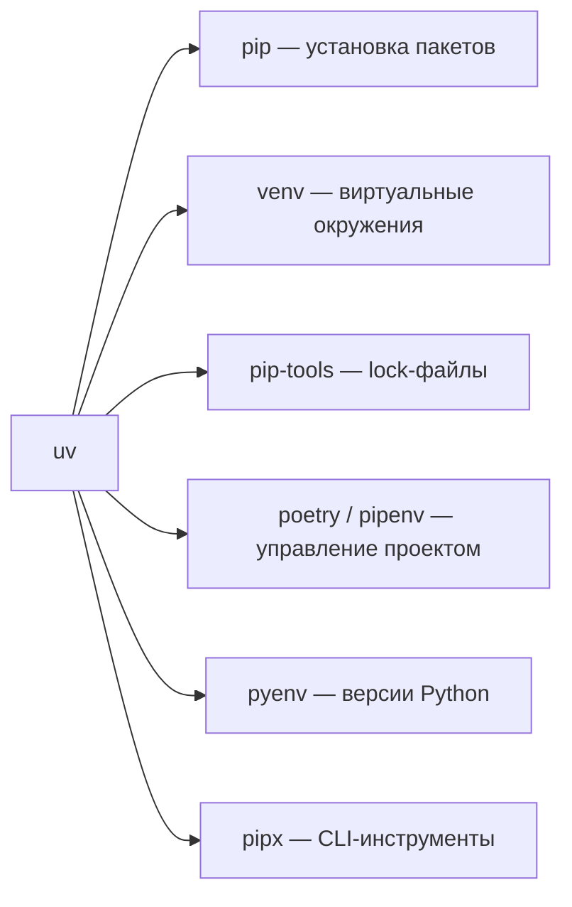
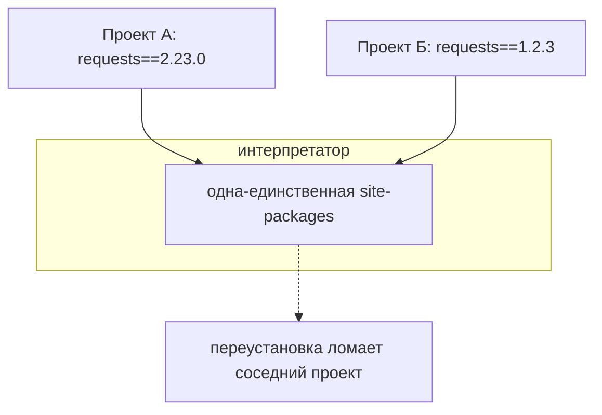
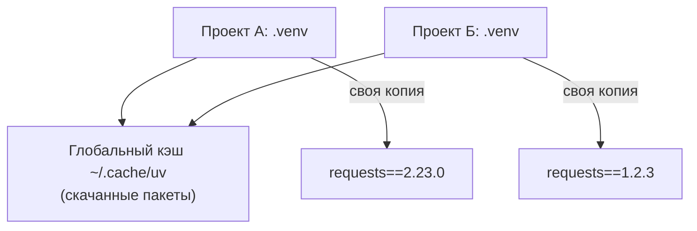
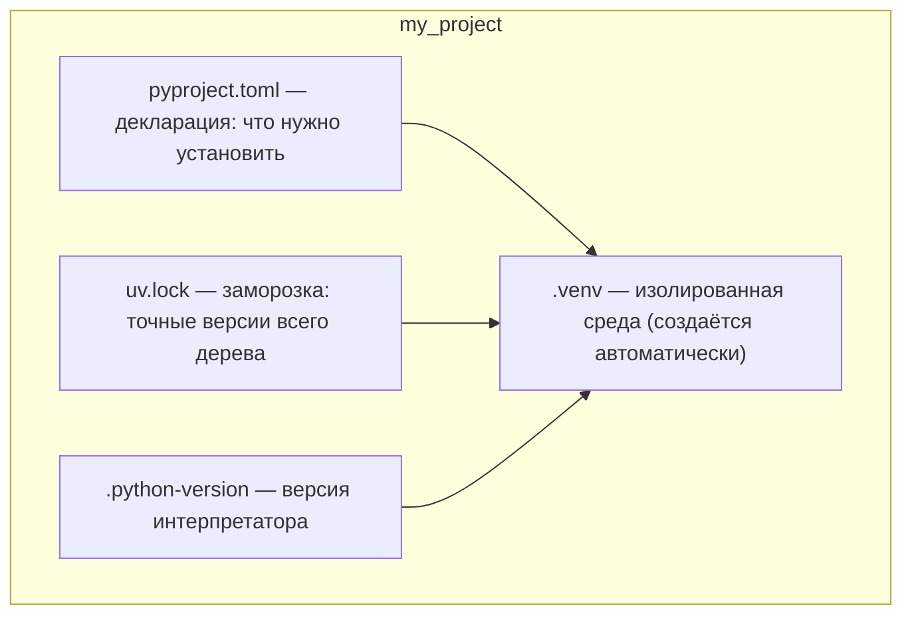
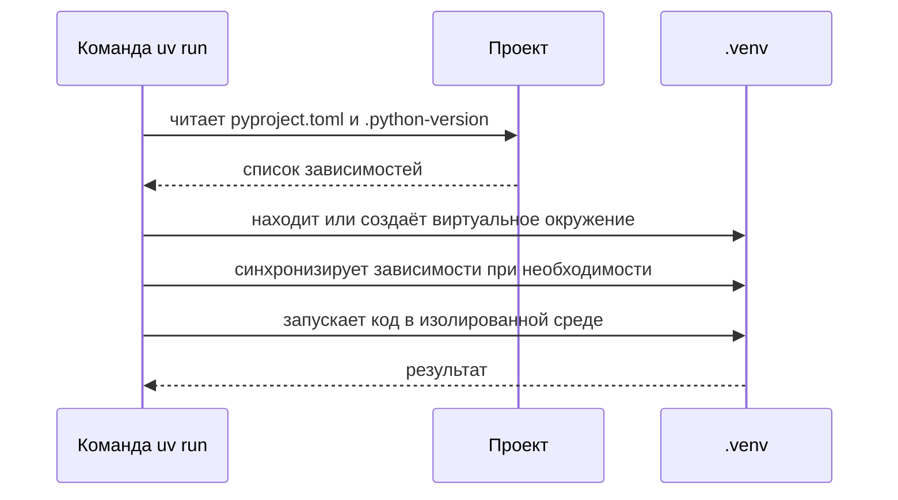

# uv — сводная шпаргалка

> **uv** — сверхбыстрый менеджер пакетов, окружений и версий Python (написан на Rust). Он заменяет собой целую связку классических инструментов: `pip`, `venv`, `pip-tools`, `poetry`, `pyenv` и `pipx` — одним бинарником. Всё, что раньше требовало ручных шагов (`python -m venv`, активация, `pip install`, `pip freeze > requirements.txt`), uv делает автоматически.

### С чего начать новичку

Шпаргалка построена **от простого к сложному** — просто идите по разделам сверху вниз, команды можно пробовать в отдельной песочной папке:

1. **Что такое uv** — 2 минуты теории (раздел ниже);
2. **Зачем виртуальные окружения** — почему без них нельзя (важно!);
3. **Установка uv** — один раз, занимает минуту;
4. **uv python** — как uv сам ставит и выбирает версии Python;
5. **uv venv** — первое виртуальное окружение;
6. **uv init → uv add → uv run** — это и есть 80% ежедневной работы;
7. Дальше — по вкусу: версии и lock-файлы, скрипты, `uvx`, линтеры, публикация пакета.

## Содержание


- [С чего начать новичку](#с-чего-начать-новичку)
- [Содержание](#содержание)
- [Что такое uv](#что-такое-uv)
  - [Один инструмент вместо пяти](#один-инструмент-вместо-пяти)
- [Зачем нужны виртуальные окружения](#зачем-нужны-виртуальные-окружения)
  - [Проблема «одна site-packages»](#проблема-одна-site-packages)
  - [Дерево зависимостей](#дерево-зависимостей)
- [Установка uv](#установка-uv)
  - [Linux и macOS](#linux-и-macos)
  - [Windows](#windows)
  - [Пакетные менеджеры ОС](#пакетные-менеджеры-ос)
  - [Обновление, автодополнение и удаление](#обновление-автодополнение-и-удаление)
- [Управление Python: uv python](#управление-python-uv-python)
  - [Список и установка версий](#список-и-установка-версий)
  - [Как выглядит вывод uv python list](#как-выглядит-вывод-uv-python-list)
  - [Обновление и удаление интерпретатора](#обновление-и-удаление-интерпретатора)
  - [Где находится текущий Python: uv python find](#где-находится-текущий-python-uv-python-find)
- [Виртуальное окружение: uv venv](#виртуальное-окружение-uv-venv)
  - [Создание и активация](#создание-и-активация)
  - [Название директории окружения](#название-директории-окружения)
- [Фиксирование версии Python](#фиксирование-версии-python)
  - [Команда uv python pin](#команда-uv-python-pin)
  - [Файл .python-version](#файл-python-version)
  - [Предостережение о смене версии](#предостережение-о-смене-версии)
- [Создание проекта: uv init](#создание-проекта-uv-init)
  - [Варианты команды](#варианты-команды)
  - [Что внутри проекта](#что-внутри-проекта)
  - [pyproject.toml — декларация проекта](#pyprojecttoml--декларация-проекта)
  - [uv.lock — заморозка версий](#uvlock--заморозка-версий)
  - [.python-version и .gitignore](#python-version-и-gitignore)
- [Запуск кода: uv run](#запуск-кода-uv-run)
  - [Запуск скрипта и проекта](#запуск-скрипта-и-проекта)
  - [uv run с CLI-инструментами](#uv-run-с-cli-инструментами)
  - [Как это работает (последовательность)](#как-это-работает-последовательность)
- [Управление зависимостями: add / remove](#управление-зависимостями-add--remove)
  - [Добавление пакетов](#добавление-пакетов)
  - [Версии пакетов](#версии-пакетов)
  - [Dev-зависимости](#dev-зависимости)
  - [Удаление](#удаление)
- [Обновление и синхронизация](#обновление-и-синхронизация)
  - [uv lock](#uv-lock)
  - [uv sync](#uv-sync)
  - [Обновление пакетов](#обновление-пакетов)
- [Просмотр зависимостей: uv pip list, uv tree](#просмотр-зависимостей-uv-pip-list-uv-tree)
- [Скрипты без проекта](#скрипты-без-проекта)
  - [Запуск файла и stdin](#запуск-файла-и-stdin)
  - [Запуск с пакетами: uv run --with](#запуск-с-пакетами-uv-run---with)
  - [Скрипты с метаданными: inline metadata](#скрипты-с-метаданными-inline-metadata)
  - [Lock для скрипта](#lock-для-скрипта)
  - [Скрипт внутри проекта: --no-project](#скрипт-внутри-проекта---no-project)
- [Инструменты: uvx и uv tool](#инструменты-uvx-и-uv-tool)
  - [uvx — запуск без установки](#uvx--запуск-без-установки)
  - [Версии, источники и Python для uvx](#версии-источники-и-python-для-uvx)
  - [uv tool — постоянная установка](#uv-tool--постоянная-установка)
  - [Управление инструментами](#управление-инструментами)
- [Линтеры, форматтеры и тесты](#линтеры-форматтеры-и-тесты)
  - [ruff — линтер и форматтер](#ruff--линтер-и-форматтер)
  - [black — форматтер](#black--форматтер)
  - [pytest — тесты](#pytest--тесты)
  - [pre-commit](#pre-commit)
  - [CI/CD (GitHub Actions)](#cicd-github-actions)
- [Сборка и публикация пакета](#сборка-и-публикация-пакета)
  - [Структура пакета](#структура-пакета)
  - [uv build](#uv-build)
  - [uv publish](#uv-publish)
  - [Установка своего пакета](#установка-своего-пакета)
- [uv в режиме pip](#uv-в-режиме-pip)
- [Сравнение с другими инструментами](#сравнение-с-другими-инструментами)
  - [pip + venv](#pip--venv)
  - [Poetry](#poetry)
  - [pipenv](#pipenv)
  - [Таблица сравнения](#таблица-сравнения)
- [Сводка команд](#сводка-команд)
- [Тренажёры и практика](#тренажёры-и-практика)
- [Онлайн-тренажеры и ресурсы](#онлайн-тренажеры-и-ресурсы)
- [Полезные ссылки](#полезные-ссылки)

---

## Что такое uv

**uv** — это быстрый и современный инструмент, написанный на **Rust**, для работы с проектами на Python. Он умеет:

- устанавливать и переключать **версии Python**;
- создавать **виртуальные окружения**;
- устанавливать и **фиксировать зависимости** (`uv.lock`), чтобы проект собирался одинаково везде;
- запускать **скрипты** и **CLI-инструменты** в изолированном окружении;
- **собирать и публиковать** пакеты на PyPI.

Если Python уже установлен в системе, uv обнаружит и будет использовать его без настройки. При этом uv умеет самостоятельно устанавливать недостающие версии Python по мере необходимости — **вам не нужно вручную ставить Python, чтобы начать работу**.

### Один инструмент вместо пяти



---

## Зачем нужны виртуальные окружения

**Виртуальное окружение (`venv`)** — это изолированная среда, где хранятся собственные версии Python и пакетов. Каждый проект получает своё собственное окружение, чтобы зависимости не пересекались.

Чтобы понять, зачем это нужно, разберёмся, как работает обычный `pip`.

При установке библиотеки `pip` скачивает пакет из **PyPI** и распаковывает его в директорию `site-packages` вашего интерпретатора:

```text
pip install requests
        │
        ▼
PyPI ──► site-packages  (единая директория интерпретатора)
```

> Ключевые факты: установка пакета напрямую влияет на файловую систему, а у интерпретатора Python есть **только одна** директория `site-packages`, куда `pip` и ставит пакеты.

### Проблема «одна site-packages»

В один интерпретатор нельзя установить две версии одной библиотеки одновременно: новая версия «перезатирает» старую. А значит, два проекта с несовместимыми версиями не могут работать одновременно:



Ситуация кажется маловероятной, но такое случается. Переключение между проектами требует каждый раз переустанавливать зависимости — а это легко забыть.

### Дерево зависимостей

Проблема усугубляется тем, что прямые зависимости тянут за собой свои зависимости, те — свои. В итоге получается целое **дерево зависимостей**, и если где-то в нём окажется библиотека не той версии, проект может начать вести себя странно — вплоть до ошибок, которые никто до вас в интернете не встречал.

**Решение** — изолировать каждый проект. Это и делают виртуальные окружения, а uv автоматизирует весь этот процесс.

В uv изоляция работает так — глобальный кэш ускоряет установку, но каждый проект получает свою копию:



---

## Установка uv

uv — свободный (open source) инструмент (лицензия MIT). Установить его можно несколькими способами.

### Linux и macOS

```bash
curl -LsSf https://astral.sh/uv/install.sh | sh
```

Если `curl` отсутствует:

```bash
wget -qO- https://astral.sh/uv/install.sh | sh
```

### Windows

```powershell
powershell -ExecutionPolicy ByPass -c "irm https://astral.sh/uv/install.ps1 | iex"
```

### Пакетные менеджеры ОС

```bash
# macOS
brew install uv

# любой дистрибутив с cargo (сборка из исходников)
cargo install --locked uv
```

Альтернатива из мира Python — установить uv себе в изолированное окружение через `pipx` (или обычным `pip`):

```bash
pipx install uv          # рекомендованный pip-вариант
pip install uv           # проще, но ставится в текущий интерпретатор
```

### Обновление, автодополнение и удаление

```bash
uv self update                        # самообновление (если ставили официальным установщиком)

# автодополнение команд в терминале
echo 'eval "$(uv generate-shell-completion bash)"' >> ~/.bashrc
```

Удаление:

```bash
uv cache clean                         # очистить кэш (по желанию)
rm -r "$(uv python dir)"               # удалить установленные uv интерпретаторы (по желанию)
rm -r "$(uv tool dir)"                 # удалить uv-инструменты (по желанию)
rm ~/.local/bin/uv ~/.local/bin/uvx    # удалить сами бинарники
```

---

## Управление Python: uv python

uv не только находит уже установленные в системе версии Python, но и умеет скачивать и устанавливать новые — разные версии рядом друг с другом.

### Список и установка версий

```bash
uv python list                # список доступных версий (и какие уже установлены)
uv python install             # последняя версия Python
uv python install 3.12        # конкретная версия
uv python install 3.11 3.12   # сразу несколько версий
```

### Как выглядит вывод uv python list

```text
cpython-3.13.3-linux-x86_64-gnu                   /bin/python3.13
cpython-3.13.3-linux-x86_64-gnu                   /bin/python3 -> python3.13
cpython-3.13.3-linux-x86_64-gnu                   /bin/python -> ./python3
cpython-3.13.2+freethreaded-linux-x86_64-gnu      <download available>
cpython-3.13.2-linux-x86_64-gnu                   <download available>
...
```

Установленные версии показывают путь, не установленные — строку `<download available>`.

### Обновление и удаление интерпретатора

```bash
uv python install --reinstall    # переустановить/обновить установленные версии
uv python uninstall 3.11         # удалить конкретную версию
```

### Где находится текущий Python: uv python find

```bash
uv python find
```

Команда выводит путь до текущего активного интерпретатора (внутри окружения — до `.venv/bin/python`).

---

## Виртуальное окружение: uv venv

### Создание и активация

```bash
cd my_dir
uv venv                          # создаёт виртуальное окружение в директории .venv
source ./.venv/bin/activate      # активация (Linux/macOS)
.venv\Scripts\activate           # активация (Windows Powershell)
```

Проверить, что окружение активно:

```bash
uv python find
# выведет путь вида: ~/projects/my_dir/.venv/bin/python3
```

> Активировать окружение чаще всего **не обязательно**: `uv run`, `uv add` и другие команды сами работают с правильным окружением проекта. Активация нужна в основном для внешних программ — например, чтобы дебаггер IDE нашёл интерпретатор: `deactivate` + `uv python find` по-прежнему укажут на `.venv`.

### Название директории окружения

Можно указать имя вручную:

```bash
uv venv .my_env
```

Но имейте в виду: называть директорию окружения нестандартно стоит только при веской причине — uv может автоматически не увидеть пакеты, если окружение лежит не в стандартном `.venv`.

---

## Фиксирование версии Python

Иногда проект требует конкретную версию Python (например, легаси-проект живёт на `3.8`). uv позволяет закрепить версию за директорией.

### Команда uv python pin

```bash
uv python install 3.8     # при необходимости — сначала ставим нужную версию
uv python pin 3.8         # закрепляем её за текущей директорией
```

Проверить выбранную версию:

```bash
uv python find                       # покажет путь к интерпретатору в .venv
uv run python --version              # покажет закреплённую версию, напр. Python 3.8
```

Закрепить за директорией версию, установленную в системе:

```bash
python --version          # например: Python 3.13.7
uv python pin 3.13.7
```

### Файл .python-version

Обратите внимание на появившийся в директории скрытый файл `.python-version` — в нём uv хранит закреплённую версию:

```bash
ls -la                    # увидите .python-version среди прочих
cat .python-version       # например: 3.13.7
```

### Предостережение о смене версии

Если проект уже создан и в нём установлены зависимости, смена версии Python может «сломать» запуск: пакеты могут иметь breaking changes относительно версии интерпретатора. Это особенно актуально при **понижении** версии. Меняйте версию осознанно и переустанавливайте окружение при необходимости.

---

## Создание проекта: uv init

### Варианты команды

```bash
uv init my_project        # создаёт папку my_project и инициализирует проект внутри
cd my_project

uv init                  # инициализировать проект в ТЕКУЩЕЙ директории (папку не создаёт)
uv init --bare           # только pyproject.toml, без примеров кода
uv init --python 3.12 another_project   # сразу с конкретной версией Python
```

> Имя проекта — только буквы, цифры и дефисы, без пробелов и спецсимволов. Соглашение: `kebab-case` (`my-awesome-project`) либо `snake_case` (`my_awesome_project`). В текущей директории не должно быть проекта с таким же именем — иначе будет ошибка.

`uv init my_project` автоматически: создаёт директорию, инициализирует проект и Git-репозиторий (`.git`), переходит внутрь.

### Что внутри проекта

После `uv init my_project` появляется такая структура:

```text
my_project/
├── pyproject.toml
├── uv.lock
├── .gitignore
├── .python-version
├── main.py                # стартовый скрипт
└── README.md
```



Более развёрнутая структура проекта (с кодом в `src/` и тестами):

```text
my_project/
├── pyproject.toml
├── uv.lock
├── .gitignore
├── src/
│   └── my_project/
│       ├── __init__.py
│       └── main.py
├── tests/
│   ├── __init__.py
│   └── test_main.py
└── README.md
```

- `src/my_project/` — исходный код; `__init__.py` делает папку пакетом Python, `main.py` — основной модуль;
- `tests/` — тесты (`test_main.py`);
- `README.md` — документация проекта.

### pyproject.toml — декларация проекта

Это **главный конфигурационный файл**: метаданные (имя, версия, описание), зависимости, настройки инструментов, информация для сборки и публикации.

```toml
[project]
name = "my-first-uv-project"
version = "0.1.0"
description = "Add your description here"
readme = "README.md"
requires-python = ">=3.10"
dependencies = []
```

Когда добавляете зависимость командой `uv add fastapi`, uv сам обновит файл:

```toml
[project]
dependencies = ["fastapi>=0.115"]
```

> `pyproject.toml` — **декларация**: здесь вы указываете, *что нужно установить* (можно диапазонами). В нём нет точных версий.

### uv.lock — заморозка версий

`uv.lock` создаётся автоматически и содержит **точные версии** всех зависимостей — прямых и транзитивных (всего дерева):

```toml
[[package]]
name = "fastapi"
version = "0.115.0"
dependencies = ["pydantic>=2.0.0", "starlette>=0.37.0"]
```

> Резюме: `pyproject.toml` — это то, **что вы хотите**, а `uv.lock` — то, **что вы получили**. Файл не редактируется руками и **обязательно коммитится в Git** — тогда среда воссоздастся идентично у любого разработчика.

### .python-version и .gitignore

- `.python-version` — содержит строку закреплённой версии (например `3.10`);
- `.gitignore` — автоматически игнорирует виртуальные среды, кэши и временные файлы:

```text
.venv/
__pycache__/
*.pyc
*.pyo
.pytest_cache/
.coverage
```

---

## Запуск кода: uv run

`uv run` — универсальный способ запустить Python-команду **в контексте проекта**. Он гарантирует, что используется правильное окружение и все зависимости установлены (при необходимости uv сам их доустановит).

### Запуск скрипта и проекта

```bash
uv run python                 # запустить интерпретатор
uv run main.py                # запустить скрипт/проект
uv run uvicorn main:app --port 8080 --reload   # запустить приложение (uvicorn установится сам, если его нет)
```

Команда `uv run main.py` автоматически создаёт (если нужно) `.venv`, синхронизирует зависимости из `pyproject.toml` и запускает код внутри окружения.

### uv run с CLI-инструментами

Так можно выполнять любые CLI-инструменты проекта, не активируя окружение вручную:

```bash
uv run pytest
uv run black .
uv run ruff check .
```

### Как это работает (последовательность)



Справка по любой команде:

```bash
uv --help
uv add --help         # справка по команде add
uv python list --help
uv remove --help
uv self update --help
```

---

## Управление зависимостями: add / remove

### Добавление пакетов

```bash
uv add fastapi[standard]                        # пакет с «экстрами»
uv add fastapi[standard] uvicorn[standard]      # сразу несколько пакетов
```

Что происходит под капотом после `uv add`:

1. uv определяет подходящую версию пакета;
2. устанавливает библиотеку в окружение проекта;
3. добавляет запись в `pyproject.toml`;
4. обновляет `uv.lock`, фиксируя точные версии всех пакетов и их зависимостей.

Импортировать зависимости существующего проекта из `requirements.txt`:

```bash
uv add -r requirements.txt
```

### Версии пакетов

```bash
uv add "fastapi[standard]==0.114.2"    # точная версия
uv pip install -r requirements.txt     # pip-подобный способ (см. раздел про pip-режим)
```

### Dev-зависимости

То, что нужно для разработки (тесты, линтеры), не должно попадать в «боевую» сборку:

```bash
uv add --dev pytest ruff black
```

После этого в `pyproject.toml` появится секция `[dependency-groups]`:

```toml
[dependency-groups]
dev = [
    "black>=24.8.0",
    "pytest>=8.3.5",
    "ruff>=0.13.3",
]
```

### Удаление

```bash
uv remove fastapi
```

Команда обновит оба файла — `pyproject.toml` и `uv.lock` — и удалит пакет из окружения.

---

## Обновление и синхронизация

### uv lock

`uv lock` обновляет файл `uv.lock`, следуя ограничениям из `pyproject.toml`:

```bash
uv lock                       # пересчитать uv.lock
uv lock --upgrade             # обновить ВСЕ зависимости до последних версий
uv lock --upgrade-package requests    # обновить один конкретный пакет
uv lock --script secondary.py         # заморозить версии для скрипта (см. ниже)
```

> Обновить отдельный пакет «со стопроцентной гарантией» невозможно: от него могут зависеть другие библиотеки, и обновление может сломать проект. Поэтому токчечное обновление — всегда осторожный шаг.

### uv sync

`uv sync` приводит содержимое окружения в соответствие с `pyproject.toml`: недостающие пакеты доустанавливаются, лишние удаляются.

```bash
uv sync                        # собрать окружение
uv sync --locked               # строго по lock-файлу (запрещает его менять)
uv sync --all-groups           # синхронизировать все группы зависимостей (включая dev)
uv sync --only-group dev       # только dev-группа
uv sync --no-dev               # всё, кроме dev-зависимостей
```

`uv run` тоже автоматически синхронизирует окружение при каждом запуске — `uv sync` нужен для явного контроля.

### Обновление пакетов

```bash
uv upgrade                     # обновить зависимости и lock-файл
uv add --upgrade fastapi       # обновить конкретный пакет, не трогая остальные
```

---

## Просмотр зависимостей: uv pip list, uv tree

```bash
uv pip list
```

Выведет таблицу установленных пакетов:

```text
Package           Version
----------------- ---------
annotated-types   0.7.0
anyio             4.11.0
certifi           2025.10.5
click             8.3.0
fastapi           0.118.0
...
```

Чтобы увидеть **древовидную структуру** зависимостей (кто кого тянет):

```bash
uv tree
```

Вывод примерно такой:

```text
Resolved 41 packages in 2ms
my-app v0.1.0
├── fastapi[standard] v0.118.0
│   ├── pydantic v2.11.10
│   │   ├── annotated-types v0.7.0
│   │   ├── pydantic-core v2.33.2
│   │   │   └── typing-extensions v4.15.0
│   │   └── email-validator v2.3.0 (extra: email)
│   │       ├── dnspython v2.8.0
│   │       └── idna v3.10
│   └── starlette v0.48.0
│       └── anyio v4.11.0
...
```

Это быстрый способ понять, почему в окружении появился тот или иной пакет.

---

## Скрипты без проекта

Скрипт здесь — отдельный файл, не относящийся к проекту. uv умеет запускать такие файлы с нужными зависимостями.

### Запуск файла и stdin

```bash
uv run main.py                            # запустить файл
echo 'print("Hello world!")' | uv run -  # запустить скрипт со стандартного ввода
```

### Запуск с пакетами: uv run --with

Если скрипту нужна библиотека, которой нет в системе:

```bash
uv run --with requests main.py
```

Пример скрипта, который без `--with requests` не запустится:

```python
import json
import requests

URL = 'https://rickandmortyapi.com/api/character/?page=1'

def main():
    res = requests.get(URL)
    print(json.dumps(res.json(), indent=4))

if __name__ == '__main__':
    main()
```

### Скрипты с метаданными: inline metadata

Современные версии Python позволяют хранить метаданные прямо в начале скрипта — важно, что это формат **PEP 723**, и uv его полностью поддерживает. Такая «заготовка» генерируется командой:

```bash
uv init --script secondary.py --python 3.10
```

Результат:

```python
# /// script
# requires-python = ">=3.10"
# dependencies = []
# ///

def main() -> None:
    print('Hello from secondary.py!')


if __name__ == '__main__':
    main()
```

Заполним метаданные — зафиксируем версию и добавим зависимость:

```python
# /// script
# requires-python = "==3.10.0"
# dependencies = ["requests"]
# ///
import sys
import json
import requests

URL = 'https://rickandmortyapi.com/api/character/?page=1'


def main() -> None:
    print(sys.version_info)
    res = requests.get(URL)
    print(json.dumps(res.json(), indent=4))


if __name__ == '__main__':
    main()
```

Запускаем:

```bash
uv run secondary.py
```

Программа использует Python **3.10** (хотя в системе может стоять 3.13), скачает `requests` и выполнит скрипт — всё автоматически.

Добавить зависимость в метаданные существующего скрипта:

```bash
uv add --script secondary.py 'loguru'
```

Другой способ — шебанг в начале файла, указывающий, что файл запускается через uv:

```python
#!/usr/bin/env -S uv run --script
# /// script
# requires-python = ">=3.12"
# dependencies = ["httpx"]
# ///
import httpx

if __name__ == "__main__":
    print(httpx.get("https://example.com"))
```

### Lock для скрипта

```bash
uv lock --script secondary.py      # создаст secondary.py.lock рядом со скриптом
uv tree --script secondary.py      # дерево зависимостей конкретно для скрипта
```

```text
Resolved 8 packages in 0.70ms
requests v2.32.3
├── certifi v2025.1.31
├── charset-normalizer v3.4.1
├── idna v3.10
└── urllib3 v2.4.0
loguru v0.7.3
```

### Скрипт внутри проекта: --no-project

Если скрипт лежит в директории проекта, но должен выполняться **отдельно** от него:

```bash
uv run --no-project main.py
```

Скрипт со встроенными зависимостями выполняется сам по себе — флаг не нужен, зависимости проекта игнорируются автоматически.

---

## Инструменты: uvx и uv tool

Бывают ситуации, когда Python-библиотеку нужно использовать **отдельно от проекта**, как готовую программу — без установки в систему. Для этого в uv есть механизм инструментов.

### uvx — запуск без установки

`uvx` запускает инструмент на лету, «не засоряя» ничего:

```bash
uvx ruff check               # проверить текущую директорию линтером
uvx pycowsay hello from uv   # забавный пример с коровой
```

```text
  -------------
< hello from uv >
  -------------
   \   ^__^
    \  (oo)\_______
       (__)\       )\/\
           ||----w |
           ||     ||
```

### Версии, источники и Python для uvx

```bash
uvx ruff@0.3.0 check              # конкретная версия
uvx ruff@latest check             # тэг latest
uvx --from 'ruff==0.3.0' ruff check          # то же через параметр --from
uvx --from 'ruff>0.2.0,<0.3.0' ruff check    # интервал версий
uvx --from git+https://github.com/httpie/cli@master httpie   # прямо из ветки GitHub
uvx --python 3.10 ruff            # со специфической версией Python
```

Хотя `uvx` ничего не «устанавливает», инструменты кэшируются — повторные запуски не качают их заново.

### uv tool — постоянная установка

Если инструмент нужен постоянно, установите его в собственное изолированное окружение:

```bash
uv tool install ruff
ruff --version                  # дальше можно запускать как обычную утилиту
uv tool install 'httpie>0.1.0'  # с выбором версии
uv tool install --python 3.10 ruff   # с выбором интерпретатора
uv tool install ruff>=0.4
```

> Пакет, установленный через `uv tool`, недоступен как обычный импортируемый модуль в Python — `python -c "import ruff"` выведет ошибку. Инструмент изолирован от проекта и системы.

### Управление инструментами

```bash
uv tool list                     # список установленных инструментов
uv tool upgrade ruff             # обновить конкретный
uv tool upgrade --all            # обновить все
uv tool upgrade --python 3.10 ruff       # поменять интерпретатор при обновлении
uv tool uninstall ruff           # удалить
```

---

## Линтеры, форматтеры и тесты

Для разработки удобно добавлять dev-зависимости:

```bash
uv add --dev pytest ruff black
```

Здесь:

- **pytest** — самая популярная библиотека для тестирования;
- **ruff** — линтер и форматтер (от создателей uv);
- **black** — форматтер.

### ruff — линтер и форматтер

**Линтер** — инструмент анализа исходного кода: он находит ошибки, уязвимости и нарушения стандартов стиля.

Возьмём файл, нарушающий PEP8 (неиспользуемый импорт + лишняя пустая строка):

```python
import time

def main():

    print("Hello from fix.py!")


if __name__ == "__main__":
    main()
```

```bash
uv run ruff check fix.py
```

```text
F401 [*] `time` imported but unused
 --> fix.py:1:8
  |
1 | import time
  |        ^^^^
  |
help: Remove unused import: `time`

Found 1 error.
[*] 1 fixable with the `--fix` option.
```

Можно сразу исправить автоматически:

```bash
uv run ruff check fix.py --fix
# Found 1 error (1 fixed, 0 remaining).
```

Ruff оставил пустую строку в начале файла — для этого понадобится форматтер.

### black — форматтер

**Форматтер** автоматически приводит код к единому стилю PEP8.

```bash
uv run ruff format fix.py        # форматирование через ruff
# 1 file reformatted

uv run black fix.py              # или через black
# reformatted fix.py
# All done!
# 1 file reformatted.
```

```python
def main():
    print("Hello from fix.py!")


if __name__ == "__main__":
    main()
```

> Note: `ruff` и `black` форматируют по-разному (например, black оставляет пустую строку в теле функции) — выбирайте один и настройте его в проекте.

### pytest — тесты

**Тестирование** — автоматизированные проверки кода, чтобы находить ошибки и не ломать проект будущими изменениями.

```python
def test_true():
    assert True
```

```bash
uv run pytest
```

```text
===== test session starts ======
platform linux -- Python 3.13.7, pytest-8.4.2, pluggy-1.6.0
configfile: pyproject.toml
collected 1 item

test_example.py .                                                                                                    [100%]

====== 1 passed in 0.00s =======
```

### pre-commit

uv легко интегрируется с [pre-commit](https://pre-commit.com/), чтобы линтеры и форматтеры запускались перед каждым коммитом:

```bash
uv add --dev pre-commit
```

Файл `.pre-commit-config.yaml`:

```yaml
repos:
  - repo: https://github.com/psf/black
    rev: 24.3.0
    hooks:
      - id: black
  - repo: https://github.com/astral-sh/ruff-pre-commit
    rev: v0.6.4
    hooks:
      - id: ruff
```

Активировать хуки:

```bash
uv run pre-commit install
# pre-commit installed at .git/hooks/pre-commit
```

Теперь при каждом `git commit` Ruff и Black запускаются автоматически. Если код «грязный» — коммит не пройдёт, и вы увидите, что именно нужно исправить.

### CI/CD (GitHub Actions)

В CI-пайплайнах uv особенно удобен: не нужно вручную настраивать Python и пакеты.

```yaml
name: CI

on: [push, pull_request]

jobs:
  test:
    runs-on: ubuntu-latest
    steps:
      - uses: actions/checkout@v4
      - name: Install UV
        run: curl -LsSf https://astral.sh/uv/install.sh | sh
      - name: Sync dependencies
        run: uv sync
      - name: Run checks
        run: uv run ruff check
```

---

## Сборка и публикация пакета

Вручную публиковать пакет (`setuptools`, `twine`, `poetry`) сложно. uv объединяет сборку, упаковку и публикацию в единый процесс.

### Структура пакета

```bash
uv init my_package --python 3.12
cd my_package
```

Получим базовый каркас:

```text
├── main.py
├── pyproject.toml
└── README.md
```

Добавим описание, автора и лицензию в `pyproject.toml`:

```toml
[project]
name = "my-package"
version = "0.1.0"
description = "My sample project"
authors = [{ name = "User", email = "user@example.com" }]
license = { text = "MIT" }
readme = "README.md"
requires-python = ">=3.12"
dependencies = []

[tool.uv]
package = true
```

> Главное — секция `[tool.uv]` с параметром `package = true`: она сообщает uv, что проект можно собирать и публиковать как пакет.

Создадим код пакета. Имя пакета в коде — без дефисов (замените дефисы на нижние подчёркивания):

```text
├── my_package
│   ├── __init__.py
│   └── main.py
├── pyproject.toml
└── README.md
```

`main.py`:

```python
def my_function(name: str) -> str:
    template = "Hi, my name is {name}! I'm using this package!"
    return template.format(name=name)
```

`__init__.py`:

```python
from .main import my_function

__all__ = ['my_function']
```

### uv build

```bash
uv build
```

В папке `dist/` появятся два дистрибутива:

```text
├── my_package-0.1.0-py3-none-any.whl
└── my_package-0.1.0.tar.gz
```

uv автоматически использует стандарты **PEP 517/518**, поэтому сборка полностью совместима с PyPI и другими инструментами.

### uv publish

Для публикации нужно зарегистрироваться на [PyPI](https://pypi.org/), подтвердить email, включить двухфакторную аутентификацию и создать токен для публикации на https://pypi.org/manage/account/token/

```bash
uv publish --token pypi-ВАШ_ТОКЕН
```

```text
Publishing 2 files to https://upload.pypi.org/legacy/
Uploading my_package-0.1.0-py3-none-any.whl (1.4KiB)
Uploading my_package-0.1.0.tar.gz (1.1KiB)
```

После этого пакет появится во вкладке **Your projects** на PyPI.

### Установка своего пакета

```bash
uv init --python 3.12    # новый проект
uv add my_package        # установить ваш опубликованный пакет
```

Замените содержимое `main.py`:

```python
from my_package import my_function

if __name__ == '__main__':
    print(my_function('User'))
```

Запуск:

```bash
uv run main.py
# Hi, my name is User! I'm using this package!
```

> Важно: если пакет собран на базе `python3.12`, то проект, куда вы его добавляете, должен использовать Python **не ниже** указанной версии. Имя `my_package` на PyPI уже занято — придумайте собственное уникальное имя, чтобы публикация прошла.

---

## uv в режиме pip

Для сценариев «просто поставить пакеты» существует pip-совместимый интерфейс:

```bash
uv pip install -r requirements.txt       # установить из requirements.txt
uv pip compile pyproject.toml -o requirements.txt   # сгенерировать requirements.txt из проекта
uv pip install --system <пkg>            # установить в системное окружение явно
```

В этом режиме uv ведёт себя как быстрый «ускоритель» привычного `pip`.

---

## Сравнение с другими инструментами

### pip + venv

Классический ручной путь, который uv автоматизирует (ниже — те самые команды, о которых uv заботится сам):

```bash
# создание окружения
python -m venv name_venv

# активация
venv\Scripts\activate        # Windows
venv/bin/activate            # Linux/macOS

# работа с пакетами
pip freeze                   # список установленных пакетов
pip install name_module      # установить библиотеку
pip install -U pip name_module      # обновить
pip uninstall name_module -y        # удалить
pip freeze > requirements.txt       # сохранить зависимости в файл
pip install -r requirements.txt     # установить из файла
deactivate                  # выйти из окружения
```

Уже знакомые вам грабли: окружение нужно создавать и активировать вручную, зависимости — вручную поддерживать в `requirements.txt`, есть только один `site-packages`.

### Poetry

Poetry — «младший брат» uv из мира классических менеджеров: хранит всё о проекте в `pyproject.toml`, зависимости — в `poetry.lock`. Не требует активации окружения вручную.

```bash
poetry new new_project        # создать проект
poetry init                   # инициализировать менеджер в готовом проекте
poetry install                # установить зависимости
poetry update                 # обновить (и poetry.lock)
poetry add pygame             # добавить библиотеку
poetry remove pygame          # удалить
poetry show --tree            # дерево зависимостей
poetry run python main.py     # запуск через окружение
```

Примета различий в версиях: `pygame = "^2.1"` означает «>=2.1, <3.0», `~2.1` — «>=2.1, <2.2`; формат записывается прямо в `pyproject.toml`.

### pipenv

pipenv — это **pip + venv** в одном флаконе: симбиоз утилит, создающий окружение и зависимости одной командой. Использует `Pipfile` и `Pipfile.lock`:

```bash
pipenv --python 3.8           # создать проект с конкретным Python
pipenv install requests       # установить зависимость
pipenv install --dev flake8   # dev-зависимость
pipenv graph                  # дерево зависимостей
pipenv run python script.py   # запуск в окружении
pipenv shell                  # «войти» в окружение
pipenv sync --dev             # воссоздать окружение ровно по lock-файлу
```

Плюс умеет: загружать `.env`, запускать скрипты из секции `[scripts]`, проверять зависимости на уязвимости.

### Таблица сравнения

| Инструмент | Файлы проекта | Где виртуальная среда | Кэширование | Авто-управление средой |
| --- | --- | --- | --- | --- |
| **uv** | `pyproject.toml` + `uv.lock` | `.venv/` в проекте (+ глобальный кэш пакетов) | Да | Да (`uv run`, `uv sync`) |
| **Poetry** | `pyproject.toml` + `poetry.lock` | `.venv/` в проекте | Частично | Да |
| **pipenv** | `Pipfile` + `Pipfile.lock` | глобально по хэшу проекта | Да | Да |
| **pip + venv** | `requirements.txt` | `.venv/` или `venv/` (вручную) | Нет | Нет (активировать вручную) |

**Когда что выбирать:**

- **uv** — современный стандарт для новых проектов: быстро, одна программа на всё, изоляция «из коробки»;
- **Poetry** — если проект уже на нём или нужна максимально широкая совместимость с инструментами экосистемы;
- **pipenv** — исторически удобен для приложений (плюс `.env` и проверка уязвимостей), но активно развивается и uv уже покрывает эти сценарии лучше;
- **pip + venv** — для простых случаев или когда нельзя ничего ставить.

И главное правило из темы виртуальных окружений, актуальное для любого инструмента: **никогда не ставьте `sudo pip install`** в системный интерпретатор. Для глобальных установок используйте `pip install --user ...` или пакетный менеджер ОС (пакеты вида `python3-<имя>`).

---

## Сводка команд

| Задача | Команда |
| --- | --- |
| Установить uv (Linux/macOS) | `curl -LsSf https://astral.sh/uv/install.sh \| sh` |
| Установить/список версий Python | `uv python install`, `uv python list` |
| Установить конкретные версии | `uv python install 3.11 3.12` |
| Обновить/удалить Python | `uv python install --reinstall`, `uv python uninstall 3.11` |
| Где интерпретатор | `uv python find` |
| Закрепить версию за директорией | `uv python pin 3.12` |
| Создать виртуальное окружение | `uv venv` |
| Создать проект | `uv init my_project`, `uv init --bare`, `uv init --python 3.12` |
| Добавить зависимости | `uv add fastapi[standard]`, `uv add fastapi uvicorn` |
| Dev-зависимости | `uv add --dev pytest ruff` |
| Удалить зависимость | `uv remove fastapi` |
| Запустить код в окружении | `uv run main.py`, `uv run pytest`, `uv run uvicorn main:app --reload` |
| Пересчитать lock-файл | `uv lock`, `uv lock --upgrade`, `uv lock --upgrade-package requests` |
| Синхронизировать окружение | `uv sync`, `uv sync --locked`, `uv sync --all-groups`, `uv sync --only-group dev`, `uv sync --no-dev` |
| Обновить зависимости | `uv upgrade`, `uv add --upgrade fastapi` |
| Показать пакеты/дерево | `uv pip list`, `uv tree` |
| Скрипт с пакетами на лету | `uv run --with requests main.py` |
| Скрипт с метаданными (PEP 723) | `uv init --script scr.py --python 3.10`, `uv add --script scr.py 'loguru'` |
| Lock для скрипта | `uv lock --script scr.py`, `uv tree --script scr.py` |
| Запустить CLI без установки | `uvx ruff check`, `uvx ruff@0.3.0 check` |
| Установить CLI-инструмент | `uv tool install ruff`, `uv tool list`, `uv tool upgrade --all`, `uv tool uninstall ruff` |
| Собрать пакет | `uv build` |
| Опубликовать на PyPI | `uv publish --token pypi-ВАШ_ТОКЕН` |
| pip-режим | `uv pip install -r requirements.txt`, `uv pip compile pyproject.toml -o requirements.txt`, `uv pip install --system <pkg>` |
| Справка | `uv add --help` |
| Обновить сам uv | `uv self update` |

---

## Тренажёры и практика

Интерактивные курсы и практика, где команды uv можно отрабатывать в браузере с проверкой задач.

- **Stepik — «[GG Python] UV: управляйте Python-версиями и не только»** — курс на русском, из которого собраны многие примеры ниже: версии Python, окружения, зависимости, lock-файлы, проекты, скрипты, uvx, публикация пакетов — с тестами и тренировочными задачами: https://stepik.org/course/235889
- **Stepik — «Поколение Python: курс для продвинутых»** — большой структурированный курс (лекции + тренировочные задачи), внутри которого есть модуль про uv и менеджмент пакетов: https://stepik.org/course/68343
- **Официальная документация uv: «First steps»** — короткое интерактивное введение в uv прямо из терминала браузера (официальный tutorial с командами): https://docs.astral.sh/uv/getting-started/first-steps/
- Для отработки **самого Python** (если надо подтянуть язык перед управлением пакетами):
  - **PythonTutor** — пошаговая визуализация выполнения кода: https://pythontutor.com
  - **learnpython.org** — бесплатные интерактивные уроки прямо в браузере: https://www.learnpython.org
  - **Codewars / CheckiO** — задачи по Python с рейтингом, полезно для закрепления: https://www.codewars.com, https://checkio.org

---

## Онлайн-тренажеры и ресурсы

Площадки для изучения uv и управления пакетами Python:

| Ресурс | Описание |
| --- | --- |
| [uv Documentation](https://docs.astral.sh/uv/) | Официальная документация uv — полный справочник команд и возможностей. |
| [Astral Blog](https://astral.sh/blog) | Блог авторов uv — новости, релизы, сравнения с pip/poetry. |
| [Exercism: Python](https://exercism.org/tracks/python) | Задачи по Python на Exercism — можно использовать uv для запуска. |
| [Python Packaging Guide](https://packaging.python.org/) | Официальное руководство по упаковке Python-проектов. |
| [PyPI](https://pypi.org/) | Индекс пакетов Python — можно искать и устанавливать через uv. |
| [pip и uv](https://docs.astral.sh/uv/pip-compatibility/) | Сравнение команд uv и pip — быстрый переход. |

---

## Полезные ссылки

- **Официальная документация uv**: https://docs.astral.sh/uv/
  - Установка: https://docs.astral.sh/uv/getting-started/installation/
  - Первые шаги: https://docs.astral.sh/uv/getting-started/first-steps/
  - Скрипты (PEP 723): https://docs.astral.sh/uv/guides/scripts/
  - Инструменты (uvx, uv tool): https://docs.astral.sh/uv/guides/tools/
  - Миграция с pip: https://docs.astral.sh/uv/guides/migration/pip-to-project/
- **Репозиторий uv (GitHub, open source)**: https://github.com/astral-sh/uv
- **Публикация пакетов: еженедельный доклад по PEP 517/518** — разбор сборки совместимой с PyPI: https://packaging.python.org/en/latest/specifications/pyproject-toml/
- **Официальные рекомендации PyPA по инструментам управления зависимостями**: https://packaging.python.org/en/latest/guides/tool-recommendations/